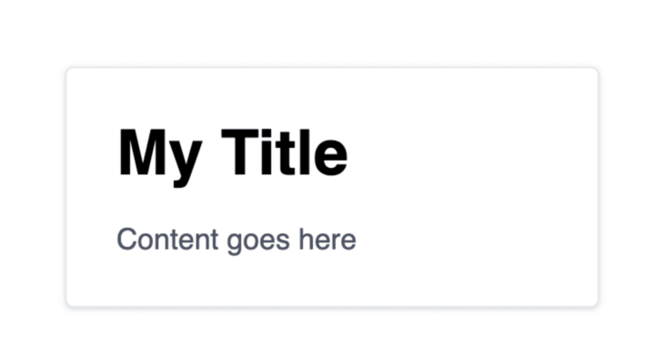

### tailwind
***

### 简介
就是一个 `CSS` 框架，和你知道的 `bootstrap，element ui，Antd，bulma`。一样。将一些 `css` 样式封装好，用来加速我们开发的一个工具。
<div style='margin-top: 50px'></div>


### 用法
实现下面的样式



原生 `css` 写法（style 部分省略）：
```js
<div class="card" style="width: 18rem;">
  <div class="card-body">
    <h5 class="card-title">Card Title</h5>
    <p class="card-text">Content goes here</p>
  </div>
</div>
```
<br>

让我们看一下 `Tailwind` 版本的实现：
::: tip
- bg-white: background: #fff
- rounded: border-radius: 0.25rem
- shadow: 0 1px 3px 0 rgba(0, 0, 0, .1), 0 1px 2px 0 rgba(0, 0, 0, .06)
- border: border-width: 1px
- p-6: padding: 1.5rem
- w-64: width: 16rem
:::

```js
// vue文件
<div class="bg-white rounded shadow border p-6 w-64">
  <h5 class="text-3xl font-bold mb-4 mt-0">My Title</h5>
  <p class="text-gray-700 text-sm">Content goes here</p>
</div>

// main.js中引入tailwind样式
import './tailwind.css'

// tailwind.css
@tailwind base;
@tailwind components;
@tailwind utilities;
```
<div style='margin-top: 50px'></div>

### 配置
`Tailwind` 允许我们 定制一切 与类相关的内容。我们可以改变所使用的颜色，字号大小，`padding` 距离，响应式布局，以及其他。

我们可以创建一个 `tailwind.config.js`，将我们的配置写入其中。这样，我们的配置将会覆盖调 `Tailwind` 默认的配置。

::: warning
`vue.config.js` 中 `postcss` 节点，优先级最高, `package.json` 文件中 `postcss` 节点的配置，优先级中; `postcss.config.js` 外置配置文件，优先级最低
:::

#### 方式一：tailwind.config.js
```js
// tailwind.config.js
module.exports = {
  purge: [],
  darkMode: false, // or 'media' or 'class'
  theme: {
    extend: {},
  },
  variants: {
    extend: {},
  },
  plugins: [],
}
```
<div style='margin-top: 30px'></div>

#### 方式二：postcss.config.js
```js
// postcss.config.js
module.exports = {
  plugins: {
    tailwindcss: { config: './tailwindcss-config.js' },
  },
}
或
// postcss.config.js
module.exports = {
  plugins: {
    tailwindcss: { config: require('@gfe/saas-kmm-tools/src/application/tailwind/index.js')},
  },
}
```
<div style='margin-top: 30px'></div>

#### 方式三：vue.config.js
```js
module.exports = {
  css: {
    loaderOptions: {
      postcss: {
        plugins: [
          require('autoprefixer'),
          require('tailwindcss')({
            config: './config/tailwindcss-config.js',
          }),
        ],
      },
    },
  },
}
```
<div style='margin-top: 30px'></div>

#### 方式四：package.json
```js
{
  "postcss": {
    plugins: {
      tailwindcss: { config: './tailwindcss-config.js' },
    },
  }
}
```
<div style='margin-top: 50px'></div>


### 🔗相关链接
- [tailwind 快速实践](https://segmentfault.com/a/1190000022622923)
- [tailwind 官网](https://docs.tailwindchina.com/docs/installation)
- [postcss 配置文件优先级](https://www.cnblogs.com/Brose/p/12598862.html)


