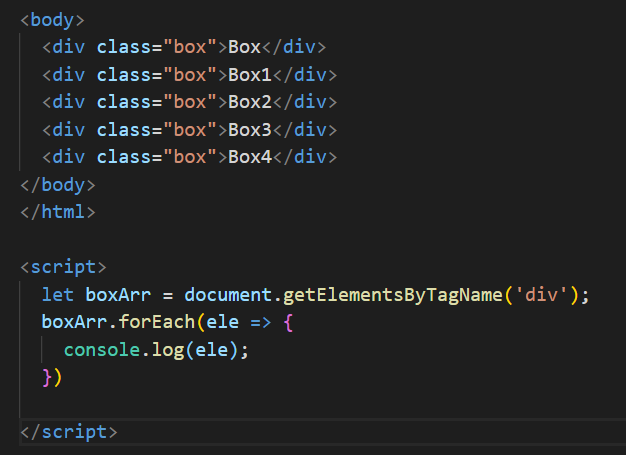
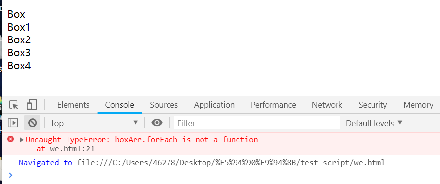
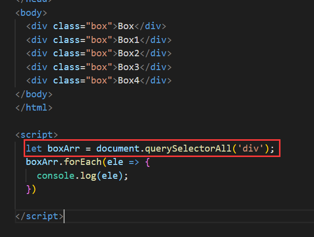
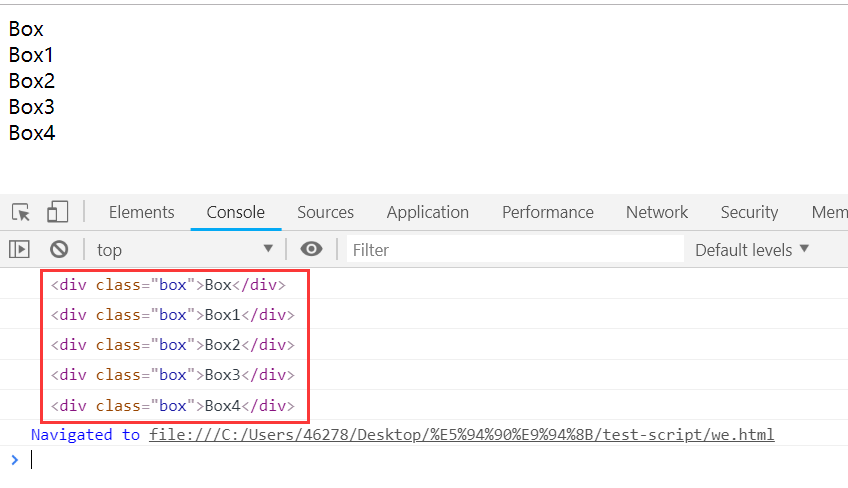
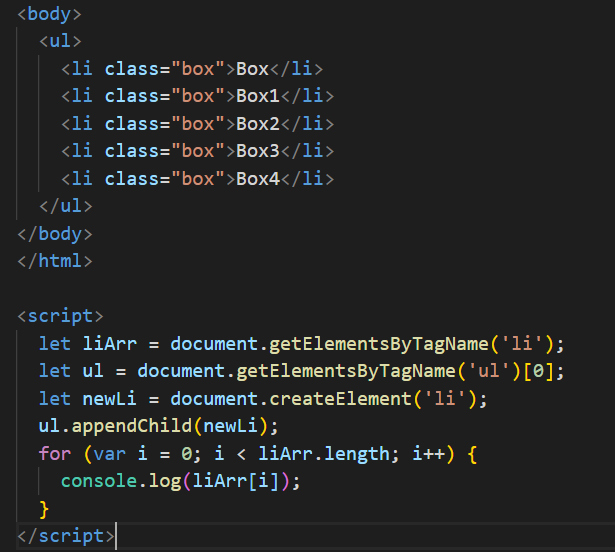
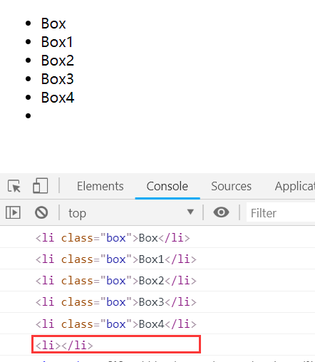
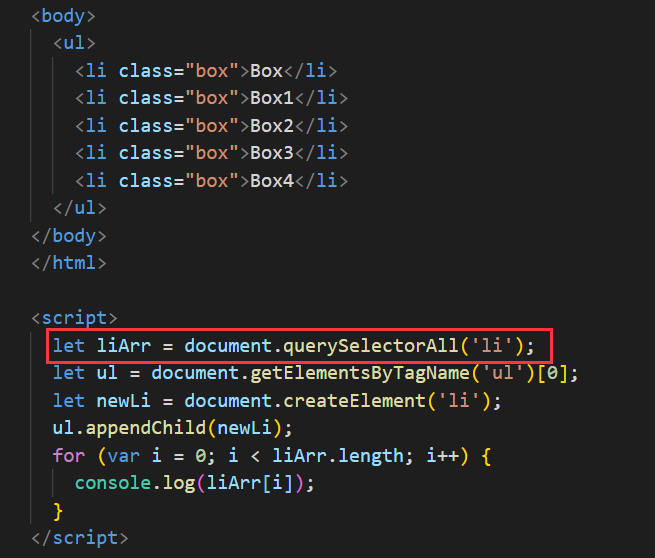
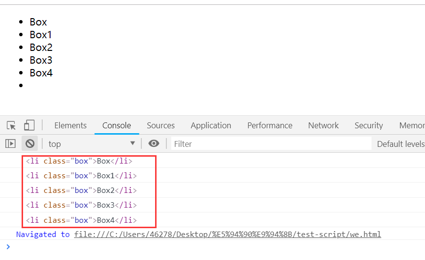
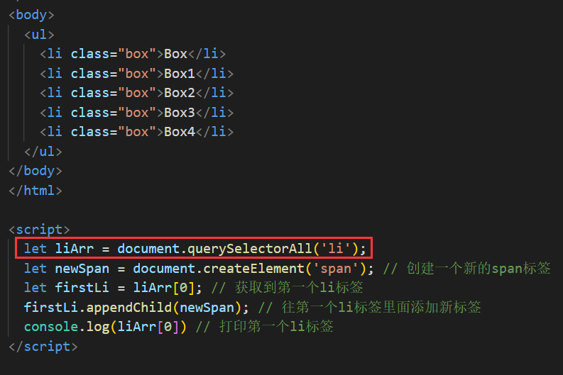
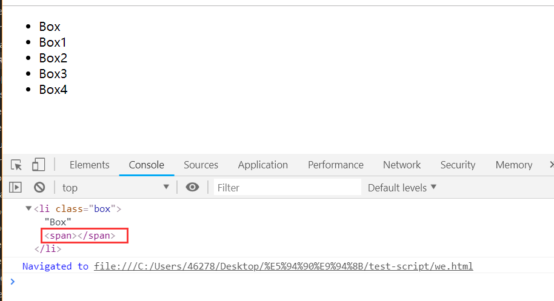

## 获取样式
##### (1)行间样式
```js
   obj.style.属性     //可用该方式获取行间样式，Obj.style.属性 = *** 可以用于设置行间或非行间样式。
```    
##### (2) 非行间样式  
```js
  function getStyle(obj, name) {   
    if(obj.currentStyle) {  
      return obj.currentStyle[name];    // IE  
    } else {  
      return getComputedStyle(obj, false)[name];  // Chrome, FF  
    }     
  }
 ```

## 深拷贝和浅拷贝
##### (1) 赋值
&nbsp;&nbsp;对基本类型进行赋值操作，两个变量互不影响。对引用类型进行赋址操作，两个变量指向同一个对象，改变对象a之后会影响对象b，哪怕改变的只是对象a中的基本类型数据。
##### (2) 浅拷贝
&nbsp;&nbsp;改变对象a之后，对象b的基本属性保持不变。但是当改变对象 a 中的对象时，对象 b 相应的位置也发生了变化。常用的浅拷贝方式有：let b = {...a};xx.slice()；xx.concat();Object.assign()。
  
  ```js
   var b1=[1,2,[3]]
   b2=[...b1]
   b1[2][0]=30  //30
   b2[2][0]    //30   
--------------------------------------------         
   var c1=[{a:1}]
   c2=[...c1]
   c1[0].a=10    //10
   c2[0].a     //10
  ```
##### (3) 深拷贝
&nbsp;&nbsp;完全改变变量 a 之后对 b 没有任何影响，这就是深拷贝的魔力。但是会忽略 undefined、会忽略 symbol、不能序列化函数、不能解决循环引用的对象、不能正确处理new Date()、不能处理正则。
  
```js
// JSON.parse(JSON.stringify(obj))
  var syb = Symbol('obj');
  var person = {
          name :'tino',
          say: function(){
              console.log('hi');
          },
          ok: syb,
          un: undefined
  }
  var copy = JSON.parse(JSON.stringify(person))  // {name: "tino"}
  -------------------------------------------------------------------------------
  // 解决方法
  function deepCopy(obj) {
    var result = Array.isArray(obj) ? [] : {};
    for (var key in obj) {
      if (obj.hasOwnProperty(key)) {
        if (typeof obj[key] === 'object' && obj[key]!==null) {
          result[key] = deepCopy(obj[key]);   //递归复制
        } else {
          result[key] = obj[key];
        }
      }
    }
    return result;
  }
```
<div style='margin-top: 100px'></div>


## 事件委托
##### (1) 支持为同一个DOM元素注册多个同类型事件

```js
// 只打印第二次
<div id="div1"></div>

window.onload = function () {
    let div1 = document.getElementById('div1');
    div1.onclick = function () {
        console.log('打印第一次')
    }
    div1.onclick = function () {
        console.log('打印第二次')
    }
}
---------------------------------------------------------------
// 两次都打印
<div id="div1"></div>

window.onload = function () {
    let div1 = document.getElementById('div1');
    div1.addEventListener('click', function () {
        console.log('打印第一次')
    })
    div1.addEventListener('click', function () {
        console.log('打印第二次')
    })
}
```
<div style='margin-top: 50px'></div>


##### (2) 可将事件分成事件捕获和事件冒泡机制
a. 当一个事件触发后,从Window对象触发,不断经过下级节点,直到目标节点。在事件到达目标节点之前的过程就是捕获阶段。所有经过的节点,都会触发对应的事件。

```js
//当useCapture为默认false时,为事件冒泡
<body>
    <div id="div1"></div>
</body>

window.onload = function () {
    let body = document.querySelector('body');
    let div1 = document.getElementById('div1');
    body.addEventListener('click', function () {
        console.log('打印body')
    })
    div1.addEventListener('click', function () {
        console.log('打印div1')
    })
}

//结果:打印div1  打印body
```
b. 当事件到达目标节点后，会沿着捕获阶段的路线原路返回。同样，所有经过的节点,都会触发对应的事件。

```js
//当useCapture为true时,为事件捕获
<body>
    <div id="div1"></div>
</body>

window.onload = function () {
    let body = document.querySelector('body');
    let div1 = document.getElementById('div1');
    body.addEventListener('click', function(){
        console.log('打印body')
    }, true)
    div1.addEventListener('click', function () {
        console.log('打印div1')
    })  // 该处可不添加true
}

//结果:打印body   打印div1
```
<div style='margin-top: 50px'></div>


##### (3) 使用事件委托可以自动绑定动态添加的元素;只需添加一个事件处理程序代理所有事件,所占用的内存空间更少。

```js
<body>
    <div id="div">
        <div class="div1">div1</div>
        <div class="div2">div2</div>
    </div>
</body>

window.onload = function () {
    let div = document.getElementById('div');
    div.addEventListener('click', function (e) {
        console.log(e.target);
    })
    let div3 = document.createElement('div');
    div3.setAttribute('class', 'div3')
    div3.innerHTML = 'div3';
    div.appendChild(div3);
}
```
<div style='margin-top: 100px'></div>


## 元素排序
先转换成数组再排序，*appendChild* 是将元素从父级中删除再插入到新的父级元素中，所以可用于元素的排序。

```js
  <ul id='oUl'>
    <li>2</li>
    <li>4</li>
    <li>1</li>
    <li>0</li>
    <li>5</li>
  </ul>
  <script>
    var aLi = [].slice.call(oUl.children);
    aLi.sort(function (a, b) {
      return a.innerHTML - b.innerHTML;
    });
    for (let i of aLi) {
      oUl.appendChild(i);
    }
  </script>
```
<div style='margin-top: 100px'></div>


## queryselector

1. 通过类似于 *document.getElementByTagName('div')* 这种方式获取到的类数组，无法通过 *forEach* 进行遍历（可以通过 *for* 循环）；而通过 *document.querySelectorAll(div)* 可以通过*forEach* 进行遍历。

（1）首先看 *getElementByTagName* 的这种情况
<p align="center">
  
</p>                                                                                                 

网页表现
<p align="center">
  
</p> 

（2）然后看 querySelectorAll 的这种情况
<p align="center">
  
</p> 

网页表现
<p align="center">
  
</p> 

2. 通过 *getElementBy* 获取这种方式获取到的数组是动态的；而 *querySelectorAll* 这种方式获取到的是静态的（但是如果是 *querySelectorAll* 获取到的 *dom* 内部发生的变化，依旧是会动态改变的）

（1）首先我们看 *getElementBy* 这种方式
<p align="center">
  
</p> 

网页表现
<p align="center">
  
</p> 

（2）我们可以看到尽管没有重新获取 *dom*，*liArr* 还是检测到了新加入的 *li* 标签。接下来我们看一下通过 *querySelectorAll* 这种方式获取到的dom列表。
<p align="center">
  
</p> 

网页表现
<p align="center">
  
</p> 

（3）接下来，我们将一个新的标签放到第一个 *li* 标签的内部。
<p align="center">
  
</p> 

网页表现
<p align="center">
  
</p> 

可以发现，通过 *querySelectorAll* 获取到的 *dom* 并不是绝对静态的，添加到这些 *dom* 内部的变化，依旧可以检测到。

<div style='margin-top: 100px'></div>


## return await 和return 区别
简而言之，*return* 后异步操作的报错是无法捕获的，用 *return await* 比较保险 [await、return 和 return await 的陷阱](https://segmentfault.com/a/1190000012370426)


  
