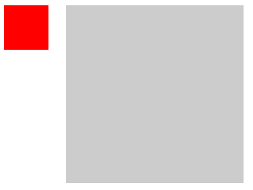
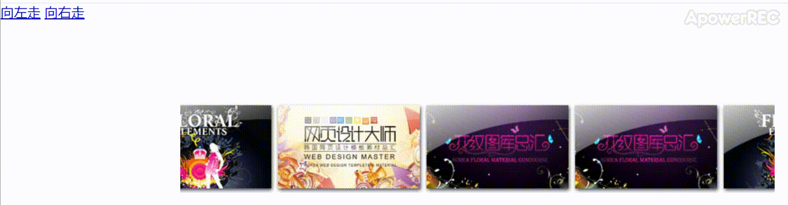
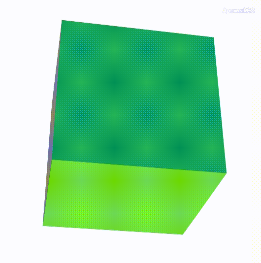
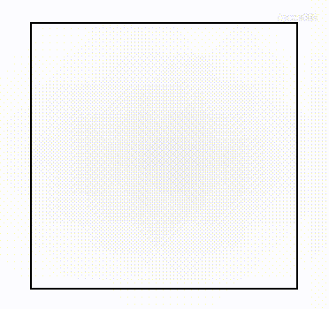
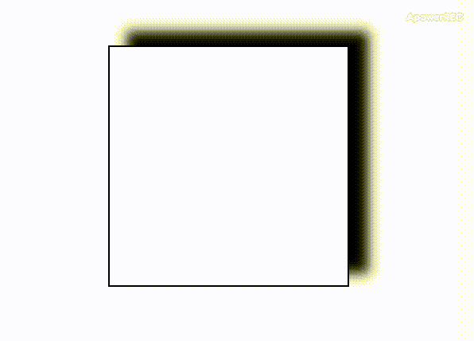
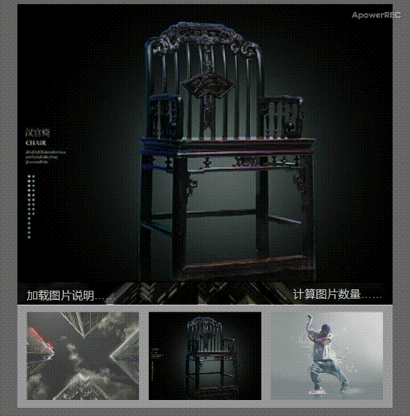
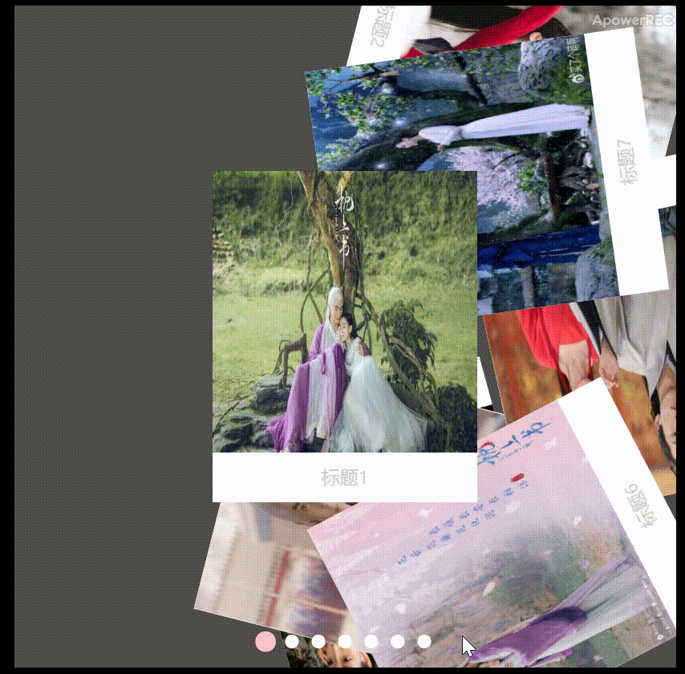

## 延时提示框      
&nbsp;&nbsp;a. 基本功能：移入红框(div1)时，灰框(div2)显示；移出时，灰框消失；  
&nbsp;&nbsp;b. 注意：红框移入灰框时，需要灰框显示，所以需要定时器；灰框移入红框时，为避免闪动，所以需用定时器；  
   <p align='center'>
      
   </p>
   
&nbsp;&nbsp;c. 代码 
   
   ```js  
      var oDiv1 = document.getElementById('div1');
      var oDiv2 = document.getElementById('div2');
      var timer = null;
      oDiv1.onmouseover = oDiv2.onmouseover = function () {
         clearTimerout(timer);
         oDiv2.style.display = 'block';  //oDiv2.onmouseover部分本可以不加(为了代码合并复用)
      }
      oDiv1.onmouseout = oDiv2.onmouseout = function () {
         timer = setTimeout(function () {
            oDiv2.style.display = 'none';
         }, 500);
      }  
   ```
<div style='margin-top: 100px'></div>


  ## 无缝滚动(原生)  
  &nbsp;&nbsp;a. 注意：添加一倍的图片，向左移动时，左边距小于长度一半时，图片拖到最左边；向右移动时，左边距大于0时，图片拖到一半处；  
  <p align='center'>
    
  </p>
  &nbsp;&nbsp;b. 代码  
   
   ```js
  <script>
      var oDiv = document.getElementById('div1');
      var oUl = oDiv.getElementsByTagName('ul')[0];
      var aLi = oUl.getElementsByTagName('li');
      var speed = -2;  // 速度
      oUl.innerHTML += oUl.innerHTML;  // 增加一倍图片
      oUl.style.width = aLi[0].offsetWidth * aLi.length+'px'; // offsetWidth：图片宽度
      
      // 移动
      function move() {
         if (oUl.offsetLeft < -oUl.offsetWidth/2) {  // offsetLeft：左边距
            oUl.style.left = '0';
         }
         if (oUl.offsetLeft > 0) {
            oUl.style.left =- oUl.offsetWidth/2 + 'px';
         }
         oUl.style.left = oUl.offsetLeft + speed + 'px';
      }
      var timer = setInterval(move, 30);

      // 移入
      oDiv.onmouseover = function () {
         clearInterval(timer);
      };

      // 移出
      oDiv.onmouseout = function () {
         timer = setInterval(move, 30);
      };
      
      // 向左走
      document.getElementsByTagName('a')[0].onclick = function () {
         speed=-2;
      };
      
      // 向右走
      document.getElementsByTagName('a')[1].onclick=function () {
         speed=2;
      };
   };
</script>

<style>
   * {margin: 0; padding: 0;}
   #div1 {width: 712px; height: 108px; margin: 100px auto; position: relative; background: red; overflow: hidden;}
   #div1 ul {position: absolute; left: 0; top: 0;}
   #div1 ul li {float: left; width: 178px; height: 108px; list-style: none;}
</style>

<body>
   <a href="javascript:;">向左走</a>
   <a href="javascript:;">向右走</a>
   <div id="div1">
       <ul>
         <li></li>
         <li></li>
         <li></li>
         <li></li>
       </ul>
   </div>
</body>
```
<div style='margin-top: 100px'></div>


## 3d盒子和shadow
### 3d盒子
transform属性从后向前执行；先布局，再旋转。X,Y面旋转需要在该对象运动前后加perspective属性，使其有3d效果；z面运动（translateZ）需要在父级元素添加
transform-style:preserve-3d;
<p align='center'>
    
</p>

```js
<style type="text/css">
    * {margin: 0;padding:0;list-style: none;}
    #div1 {width: 200px;height: 200px;background: rgba(0,0,0,0);float: left;
        position: absolute;left: 50%;top: 50%;margin: -100px 0 0 -100px;
        transform:perspective(800px) rotateX(-80deg);
        transform-style:preserve-3d;
    }
    #div1 > div {width: 100%;height: 100%;position: absolute;
        transition:1s;
    }
    #front {
        transform:translateZ(100px);
        background: yellow;
    }
    #after {
        transform:translateZ(-100px);background: red;
    }
    #left {
        transform:rotateY(90deg) translateZ(-100px) ;background: green;
    }
    #right {
        transform:rotateY(-90deg) translateZ(-100px) ;background: blue;
    }
    #topNode {
        transform:rotateX(90deg) translateZ(-100px) ;background: pink;
    }
    #bottom {
        transform:rotateX(-90deg) translateZ(-100px) ;background: orange;
    }
</style>

<div id='div1'>
	<div id='front'></div>
	<div id='after'></div>
	<div id='left'></div>
	<div id='right'></div>
	<div id='topNode'></div>
	<div id='bottom'></div>
</div>

<script type="text/javascript">
// 旋转
	var allDiv = div1.children;
	var reg = 0;
	setInterval (function () {
		reg++;
		div1.style.transform = 'perspective(800px) rotateX(' + (reg * 0.3) + 'deg) rotateY(' + 
		(reg*0.2) + 'deg)';
	}, 8);

// 变色
	setInterval(function () {
		for(var i = 0; i < allDiv.length; i++){
			allDiv[i].style.background = 'rgb(' + parseInt(Math.random() * 256) + ',' + parseInt(Math.random() 
			* 256) + ',' + parseInt(Math.random() * 256) + ')';
		}
	}, 1000);
</script>
```
<div style='margin-top: 50px'></div>


### text-shadow 文字逐渐清晰
通过修改文字的text-shadow属性，将原文字的透明度变为零，变清晰后的文字实际是阴影，而非原文字。
<p align='center'>
    
</p>
    
```js
<style type="text/css">
    * {margin: 0;padding: 0;list-style: none}
    div {width: 200px;height: 200px;
            position: absolute;left: 0;top: 0;bottom: 0;right: 0;margin: auto;border: 1px solid black;
            font-size: 30px;
            text-align: center;
            line-height: 200px;
            text-shadow:0px 0px 100px black;
            color: rgba(0,0,0,0);
            transition:1s;
    }
    div:hover {
        text-shadow:0px 0px 0px black;
    }
</style> 
```
<div style='margin-top: 50px'></div>


### box-shadow 太阳阴影效应
通过鼠标位置和屏幕宽度的比例关系设置box-shadow的水平和垂直阴影位置。
<p align='center'>
    
</p>
    
```js
<style type="text/css">
    * {margin: 0;padding: 0;list-style: none}
    div {width: 200px;height: 200px;
         position: absolute;left: 0;top: 0;bottom: 0;right: 0;margin: auto;
             border: 1px solid black;box-shadow:30px -30px 10px 0px black;
    }
</style> 

<script type="text/javascript">
	max = 30;
	document.onmousemove = function (e) {
		var ev = e || event;
		var needX = ev.clientX / innerWidth * -60 + 30;
		var needY = ev.clientY / innerHeight * -60 + 30;
		div1.style.boxShadow = needX + 'px ' + needY + 'px 10px 0px black';
	}
</script>
```
<div style='margin-top: 100px'></div>


## 运动基础
### 1.完美运动框架
&nbsp;&nbsp;适用于多物体、多属性、链式运动，是比较完美的运动框架。 *offsetWidth* 等方式获取的属性值包含 *width、padding、border*，所以如果用该方式获取包含 *border* 的对象宽度会造成物体运动出现反常，所以利用函数 *getStyle* 获取属性值。

```js
function startMove (obj, json, fnEnd) {
	clearInterval(obj.timer);
	obj.timer = setInterval(function () {
		var bStop = true;		//假设：所有值都已经到了
		for (var attr in json) {
			var cur=0;
			if (attr === 'opacity') {
				cur = Math.round(parseFloat(getStyle(obj, attr))*100); // *100后可能包含小数
			} else {
				cur = parseInt(getStyle(obj, attr));
			}
			var speed = (json[attr] - cur) / 6; // 缓冲运动，如果是匀速运动，在距离小于速度时，直接将对象设置到终点，以防来回运动；
			speed = speed > 0 ? Math.ceil(speed) : Math.floor(speed); // 防止speed出现小数，小于1像素，对象永远达不到终点。
			if (cur != json[attr])
				bStop = false;
			if (attr === 'opacity') {
				obj.style.filter = 'alpha(opacity:' + (cur + speed) + ')';
				obj.style.opacity = (cur + speed) / 100;
			} else {
				obj.style[attr] = cur + speed + 'px';
			}
		}
		if (bStop) {
			clearInterval(obj.timer);			
			if (fnEnd) fnEnd();  // 链式运动
		}
	}, 30);
}

// 获取属性
function getStyle (obj, name) {
	if (obj.currentStyle) {
		return obj.currentStyle[name];   // IE
	} else {
		return getComputedStyle(obj, false)[name];  // Chrome, FF  
	}
}
```
<div style='margin-top: 50px'></div>


### 2.轮播图（原生）
大图高先设置为0，再逐渐变为原高度，每次的index逐渐增加；小图的left逐渐变化，但需注意变化规律；
<p align='center'>
	
</p>

```js
<script>
window.onload = function () {
	var nowZIndex = 2;
	var now=0;
	oUlSmall.style.width=aLiSmall.length*aLiSmall[0].offsetWidth+'px';

	//左右按钮显示或消失
	oBtnPrev.onmouseover = oMarkLeft.onmouseover = function () {
		startMove(oBtnPrev, 'opacity', 100);
	};
	oBtnPrev.onmouseout = oMarkLeft.onmouseout = function () {
		startMove(oBtnPrev, 'opacity', 0);
	};
	oBtnNext.onmouseover = oMarkRight.onmouseover = function () {
		startMove(oBtnNext, 'opacity', 100);
	};
	oBtnNext.onmouseout = oMarkRight.onmouseout = function () {
		startMove(oBtnNext, 'opacity', 0);
	};

	// 点击小图，切换大图
	for(var i = 0; i < aLiSmall.length; i++) {
		aLiSmall[i].index = i;
		aLiSmall[i].onclick = function () {
			if(this.index == now) return;
			now = this.index;
			tab();
		};
		aLiSmall[i].onmouseover = function () {
			startMove(this, 'opacity', 100);
		};
		aLiSmall[i].onmouseout = function () {
			if (this.index != now) {
				startMove(this, 'opacity', 60);
			}
		};
	}

	// 大图切换
	function tab ()
	{
		aLiBig[now].style.zIndex = nowZIndex++;
		for (var i = 0; i < aLiSmall.length; i++) {
			startMove(aLiSmall[i], 'opacity', 60);
		}
		startMove(aLiSmall[now], 'opacity', 100);
		aLiBig[now].style.height = 0;
		startMove(aLiBig[now], 'height', 320);
		if (now == 0) {
			startMove(oUlSmall, 'left', 0);
		} else if (now == aLiSmall.length-1)
		{
			startMove(oUlSmall, 'left', -(now-2)*aLiSmall[0].offsetWidth);
		} else
		{
			startMove(oUlSmall, 'left', -(now-1)*aLiSmall[0].offsetWidth);
		}
	}
	
	 // 左右按钮点击
	oBtnPrev.onclick = function () {
		now--;
		if (now == -1) {
			now = aLiSmall.length-1;
		}
		tab();
	};
	oBtnNext.onclick = function () {
		now++;
		if(now == aLiSmall.length) {
			now = 0;
		}
		tab();
	};
	var timer = setInterval(oBtnNext.onclick, 2000);
	oDiv.onmouseover = function () {
		clearInterval(timer);
	};
	oDiv.onmouseout = function () {
		timer = setInterval(oBtnNext.onclick, 2000);
	};
};
</script>
```
<div style='margin-top: 50px'></div>


### 3.拖拽

```js
<script>
var disX = 0;
var disY = 0;
oDiv.onmousedown = function (ev)
{
	var oEvent = ev || event;
	disX = oEvent.clientX - oDiv.offsetLeft;
	disY = oEvent.clientY - oDiv.offsetTop;
	if (oDiv.setCapture) {
		//IE
		oDiv.onmousemove = mouseMove;
		oDiv.onmouseup = mouseUp; // 如果用document...会导致IE6-8拖拽时文字被选中
		oDiv.setCapture();  // 事件捕获，在其他地方的移动鼠标都可以集中到oDiv上，可防止快速拖拽时，鼠标脱离对象；
	} else {
		//Chrome、FF
		document.onmousemove = mouseMove; // chrome可以用return false防止文字被选中的默认事件
		document.onmouseup = mouseUp;
	}
	function mouseMove (ev) {
		var oEvent = ev || event;
		var l = oEvent.clientX - disX;
		var t = oEvent.clientY - disY;
		oDiv.style.left = l + 'px';
		oDiv.style.top = t + 'px';
	}
	function mouseUp () {
		this.onmousemove = null;
		this.onmouseup = null;
		if (oDiv.releaseCapture) {
			oDiv.releaseCapture();
		}
	}
	return false;	//chrome、ff、IE9下可防止默认事件的产生
};
</script>
```

### 4.轮播图（react）
<p align='center'>
	
</p>

```js
<div id="app"></div>
  <script type="text/babel">
    let picUrl = ['./img/1.jpg', './img/2.jpg', './img/3.jpg', './img/4.jpg',
                 './img/5.jpg', './img/6.jpg', './img/7.jpg'];
    let picTips = ['这是第一张图', '这是第二张图', '这是第三张图', '这是第四张图',
                 '这是第五张图', '这是第六张图', '这是第七张图'];
    class TopNode extends React.Component {
      render() {
        let aLi = picUrl.map((val, index) => {
          return <li 
                  key={index}>
                  
                  </li>
        })
        return (
          <div className='topNode'>
            <ul style={{width: picUrl.length*450+'px', left:-this.props.topIndex*440+'px'}}>{aLi}</ul>
            
            
          </div>
        )
      }
    }
    class MiddleNode extends React.Component {
      render() {
        return (
          <div className='middleNode'>
            <span className='leftTip'>{picTips[this.props.middleIndex]}</span>
            <div className='size'>
              
              
            </div>
          </div>
        )
      }
    }
    class BottomNode extends React.Component {
      render() {

        let aLi = picUrl.map((val, index) => {
          return <li 
                    key={index} 
                    onClick={this.props.bottomIndex.bind(null,index)}
                    className={this.props.index==index?'active':''}>
                    
                  </li>
        })
        return (
          <div className='bottomNode'>
            <ul 
            style={{
              width: picUrl.length*110+'px', 
              left: this.props.index>3?-(this.props.index-3)*110:0+'px'}}>
            {aLi}</ul>
          </div>
        )
      }
    }
    class Node extends React.Component {
      constructor() {
        super();
        this.state = {
          index: 0,
          scale: 1
        }
      }
      getIndex(val) {
        this.setState({
          index: val,
          scale: 1
        })
      }
      leftMove() {
        var needIndex = this.state.index == 0 ? picUrl.length - 1 : this.state.index - 1; 
        this.setState({
          index: needIndex,
          scale: 1
        })       
      }
      rightMove() {
        var needIndex = this.state.index == picUrl.length - 1 ? 0 : this.state.index + 1;
        this.setState({
          index: needIndex,
          scale: 1
        })
      }
      bigFn() {
        let needScale = this.state.scale >= 2 ? 2 : this.state.scale + 0.1;
        this.setState({
          scale:needScale
        })
      }
      smallFn() {
        let needScale = this.state.scale <= 0.5 ? 0.5 : this.state.scale - 0.1;
        this.setState({
          scale:needScale
        })
      }
      render() {
        return (
          <div className='node'>
            <TopNode 
              topIndex={this.state.index} 
              topLeft={this.leftMove.bind(this)} 
              topRight={this.rightMove.bind(this)}
              getScale={this.state.scale}/>
            <MiddleNode 
              middleIndex={this.state.index} 
              changeBig={this.bigFn.bind(this)} 
              changeSmall={this.smallFn.bind(this)}/>
            <BottomNode bottomIndex={this.getIndex.bind(this)} index={this.state.index}/>
          </div>
        )
      }
    }

    ReactDOM.render(<Node/>, app)
  </script>
```
<div style='margin-top: 50px'></div>


### 4.照片墙（react脚手架）
注意对一次点击和二次点击的处理与判断，e.target.classList 的contains 和add,remove方法
<p align='center'>
	
</p>

```js
import React, {Component} from 'react';

class Tab extends Component {
  constructor() {
    super();
    this.state = {
      index: 0,
      degY: 0,
      left: [],
      top: [],
      deg: []
    }
  }
  componentWillMount() {
    this.random();   
  }
  random() {  
    let newLeft = this.props.picUrl.map((val, index) => {
      return Math.random()*500-100;
    })
    let newTop = this.props.picUrl.map((val, index) => {
      return Math.random()*500-125;
    })
    let newDeg = this.props.picUrl.map((val, index) => {
      return Math.random()*720-360;
    })
    this.setState({
      left: newLeft,
      top: newTop,
      deg: newDeg
    })
  }

  handleClick(val, e) {
    if(e.target.classList.contains('active')) {
      if(e.target.classList.length === 1) {
        this.setState({
          degY: 180
        })
        e.target.classList.add('active2')
      } else {
        this.setState({
          degY: 0,
        })
        e.target.classList.remove('active2');
      }
    } else {
      this.setState({
        index: val
      })
      this.random()  //没有放在li中，而是放在数组中，防止点击时其他图片随机移动
    }
  }
  render() {
    let aLi = this.props.picUrl.map((val, index) => {
      return  <li 
                key={index}
                style={{left:index===this.state.index?'calc(50% - 100px)':this.state.left[index], 
                top:index===this.state.index?'calc(50% - 125px)':this.state.top[index],
                transform:index===this.state.index?'rotate(0deg) rotateY('+this.state.degY+'deg)':'rotate('+this.state.deg[index]+'deg) rotateY(0deg)',
                zIndex:index===this.state.index?100:1}}>
                <div className='pic'>
                  
                  <div className='title'>{this.props.title[index]}</div>
                </div>
                <div className='txt'>{this.props.content[index]}</div>
              </li>
    })
    let aOl = this.props.picUrl.map((val, index) => {
      return <li 
              key={index} 
              className={index===this.state.index?'active':''}
              onClick={this.handleClick.bind(this,index)}></li>
    })
    return (
      <div className='tab'>
        <ul>
          {aLi}
        </ul>
        <ol>
          {aOl}
        </ol>
      </div>
    )
  }
}

export default Tab;
```
<div style='margin-top: 100px'></div>


  
