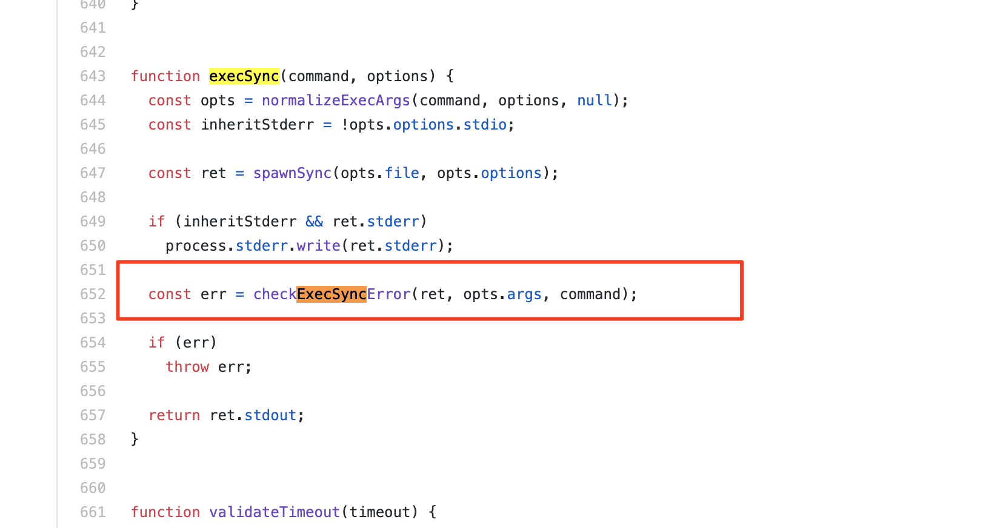
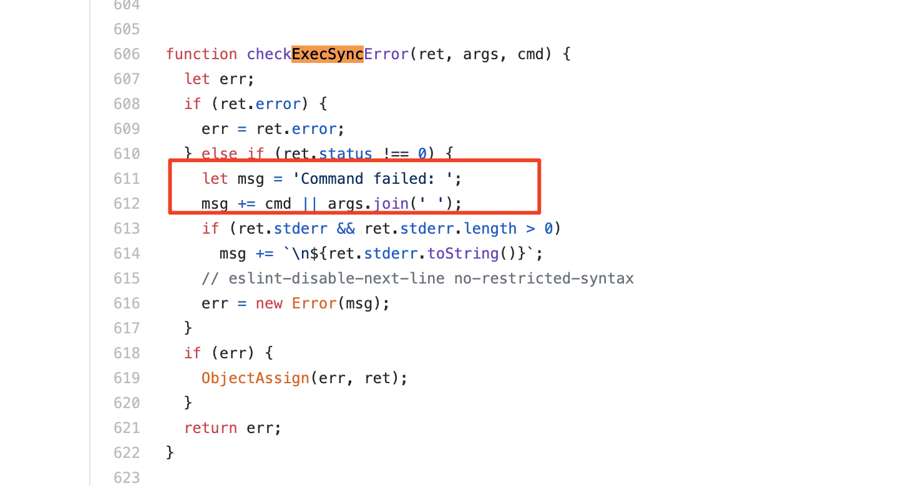
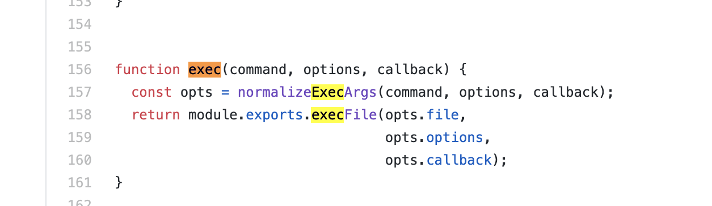

## child_process - 子进程
&nbsp;&nbsp;`Node.js` 中在单进程中单线程，非阻塞的性能非常好。但是，一个 CPU 一个进程不足以处理程序中日益增加的工作负载。无论你的服务器多么强大，一个线程只能支持有限的负载。事实上，Node.js 运行在一个单线程里面并不意味着我们不能利用多进程的优势，当然还有多机器。
&nbsp;&nbsp;我们可以使用 `Node.js` 的 `child_process` 模块很容易地衍生一个子进程，并且那些父子进程使用一个消息系统相互之间可以很容易地交流。我们可以控制子进程的输入流，并且监听它的输出流。我们也可以控制传递给潜在的操作系统命令的参数，我们可以通过那个命令的输出做我们想做的事情。比如：可以将一个命令的输出作为另一个的输入（就像我们在 Linux 做的那样），因为那些命令的输入和输出都是使用流的形式呈现给我们。

### spawn
#### 基本用法
&nbsp;&nbsp;spawn方法创建一个子进程来执行特定命令，用法与`execFile`方法类似，但是没有回调函数，只能通过监听事件，来获取运行结果。它属于异步执行，适用于子进程长时间运行的情况。
```js
child_process.spawn(command, [args], [options])
```
示例，运行 `find . -type f`，并捕获 `stdout`、 `stderr`、以及退出码：
```js
const { spawn } = require('child_process');
const child = spawn('find', ['.', '-type', 'f']);

child.stdout.on('data', (data) => {
    console.log(`stdout: ${data}`);
});

child.stderr.on('data', (data) => {
    console.error(`stderr: ${data}`);
});

child.on('close', (code) => {
    console.log(`子进程退出，退出码 ${code}`);
});
```
#### 主要参数
<a href='#spawn命令实现shell语句和其他主要参数'>主要参数</a><br>
<a href='http://nodejs.cn/api/child_process.html#child_process_child_process_spawn_command_args_options'>其他参数</a>

#### 事件
- exit     
 当子进程结束后时会触发 `exit` 事件。 如果进程退出，则 `code` 是进程的最终退出码，否则为 `null`。 如果进程是因为收到的信号而终止，则 `signal` 是信号的字符串名称，否则为 `null`（正常退出）。 这两个值至少有一个是非 `null` 的。
```js  
child.on('exit', function(code, signal){
    console.log('child process exited with' + `code ${code} and signal {signal}`)
});
```

- close     
当子进程的 `stdio` 流已被关闭时会触发 `close` 事件。 这与 `exit` 事件不同，因为多个进程可能共享相同的 stdio 流。
```js
child.on('close', function(code, signal){
    console.log('child process closed with' + `code ${code} and signal {signal}`)
});
```

- error     
每当出现以下情况时触发 `error` 事件：
无法衍生进程；
无法杀死进程；
向子进程发送消息失败。
发生错误后，可能会也可能不会触发 `exit` 事件。 当同时监听 `exit` 和 `error` 事件时，则需要防止意外地多次调用处理函数。

- message      
当子进程使用 `process.send()` 函数发送信息的时候，`message` 事件会被触发。

#### 流
&nbsp;&nbsp;每一个子进程都会得到三个标准的输入输出流，我们可以通过 `child.stdin`，`child.stdout` 和 `child.stderr` 进入。
&nbsp;&nbsp;所有的流都是事件发射器，我们可以在那些被绑定到每一个子进程的 `stdio` 流监听不同的事件。不像在一个正常的进程中，在子进程中，`stdout/stderr` 流是可读的流，而 `stdin` 是可写的流。基本上是主进程中相反类型的。可以在这些流上使用的事件是标准的。更重要的是，在可读流上，我们可以监听 `data` 事件，可以得到命令的输出和在执行命令时遇到的错误：
```js
child.stdout.on('data', (data) => {
    console.log(`child stdout: ${data}`)
});
child.stderr.on('data', (data) => {
    console.error(`stderror ${data}`);
});  
```
&nbsp;&nbsp;一个子进程 `stdin` 是一个可写的流。我们可以用它发送一个命令的输入。像任何一个可写流那样，最简单消费它的方式时使用 `pipe` 函数。我们简单地将一个可读流 `pipe` 到另一个可写流里。因为主进程的 `stdin` 是可读流，我们可以将它 `pipe` 到子进程的 `stdin` 流里。
```js
const {spawn} = require('child_process');
const child = spawn('wc');
process.stdin.pipe(child.stdin);
child.stdout.on('data', (data) => {
    console.log(`child stdout: ${data}`);
});
```
在上面的例子中，子进程执行了 `wc` 命令，是一个计算行数，单词数，和字母数的Linux 命令。我们可以将主进程的 `stdin`（是可读流）`pipe` 到子进程的 `stdin`（是一个可读流）。结合的结果是我们得到了一个标准的输入模式，我们可以输入一些东西，当 `CTRL+ D` 时，我们输入的将会被用来作为 `wc` 命令的参数。
&nbsp;&nbsp;我们也可以在多进程标准输入输出之间相互 pipe，就像我们用 Linux 命令做的那样。例如：我们可以 `pipe` `find` 命令的 `stdout` 到 `wc`（在当前目录中统计所有的文件） 命令的 `stdin` 里。
```js
const {spawn} = require('child_process');
const find = spawn('find', ['.', '-type', 'f']);
const wc = spawn('wc', ['-l']);
find.stdout.pipe(wc.stdin);
wc.stdout.on('data', (data) => {
    console.log(`Number of files ${data}`)
});
```

### exec
#### 基本用法
&nbsp;&nbsp;默认地，`spawn` 函数并没有创建一个 `shell` 去执行我们传入地命令。这使得它比 `exec` 函数执行稍微高效一点儿，`exec` 创建了个 `shell`。`exec` 函数有另一个主要地区别：将命令的输出放到缓冲区，并且将整个输出值传递给一个回调（而不是像 `spawn` 那样使用流）。
```js
child_process.exec(command, [options], callback)
```
用 `exec` 函数实现之前的示例，因为 `exec` 函数会使用 `shell `去执行命令，因此我们可以直接使用 `shell` 语法代替 `pipe` 特性。exec 函数将输出放入缓存区，并且将它作为 stdout 传递给回调函数（exec 函数的第二个参数）。stdout 是我们想要打印的命令的输出。
```js
const { exec } = require('child_process');
exec('find . -type f | wc -l', (err, stdout, stderr) => {
if (err) {
    console.error(`exec error: ${err}`);
    return;
}
console.log(`Number of files ${stdout}`);
});
```
#### 适用范围
如果你想要使用 shell 语法并且运行命令输出的所期望的数据比较小，建议使用 exec 函数（记住，exec 在返回结果数据之前，会在内存中缓存整个数据）。如果期望的数据很大，那么建议使用 spawn 函数，因为数据可以被标准的 IO 对象流化（streamed）。

#### 注意事项
如果你执行外部提供的任何类型的动态输入，使用 shell 语法是有安全风险的。用户使用 像 ；的shell 语法字符和 $ 来进行命令注入攻击（例如：command + `; rm -rf ~`）。

#### spawn命令实现shell语句和其他主要参数
- spawn命令实现shell语句  
可以使用 `spawn` 函数使用 `shell` 语法。下面是 `find | wc` 命令的 `spawn` 的实现版本：
```js
const child = spawn('find . -type f | wc -l', {
    stdio: 'inherit',
    shell: true
});
```
因为上面的 `stdio: 'inherit'` 的配置选项，当我们执行代码的时候，子进程将会继承主进程的 `stdin，stdout，stderr`。这回导致子进程数据事件处理器在主进程的 `process.stdout` 流中被触发，让脚本有正确的输出方式。因为上面的 `shell: true` 的配置选项，我们可以在传递的命令中使用 `shell` 语法，就像我们在 `exec` 函数中做的那样。但是用这段代码，我们仍能利用 `spawn` 函数输出的数据的流的特性。

- cwd      
通过 `cwd` 选项更改脚本的工作目录。统计 ~/Downloads 文件夹下所有的文件的统计信息：
```js
const child = spawn('find . -type f | wc -l', {
    stdio: 'inherit',
    shell: true,
    cwd: '/Uers/samer/Downloads'
});
```
- env        
指定子进程的环境变量。默认的是 `process.env`，给了子进程一个命令可以进入父 `process` 环境。如果我们想覆盖这个默认行为，可以给 `env` 选项一个空对象，或者给一个对象作为子进程唯一的环境变量。如下面的命令不能获取父进程的环境变量。比如：不能获取 `$HOME`，但是可以获取 `$ANSWER` ，因为是通过 `env` 选项配置的，作为子进程的局部环境变量。
```js  
const child = spawn('echo $ANSWER', {
    stdio: 'inherit',
    shell: true,
    end: {ANSWER: 42}
});
```
- detached      
使子进程独立于它的父进程运行。假设我们有一个文件 timer.js，可以是时间循环忙碌：
```js
setTimeout(() => {  
// keep the event loop busy
}, 20000);
```
我们可以使用 detached 选项在后台执行它：
```js
const { spawn } = require('child_process');
const child = spawn('node', ['timer.js'], {
    detached: true,
    stdio: 'ignore'
});
child.unref();
```
子进程 `detached` 后的行为取决于操作系统。在 `windows` 上面，解绑后（detached）的子进程有它们自己的window 控制台。然而，在 `Linux` 上面，解绑后（detached）的子进程将会领导一个新的进程组和 `session`。如果在解绑的进程上面调用 `unref` 函数，父进程可以独立于子进程退出(默认情况下，父进程将会等待被分离的子进程退出。 为了防止父进程等待 `subprocess`，可以使用 `subprocess.unref()` 方法)。如果子进程在运行一个长时间的任务，这将非常有用，但是在后台保持运行，否则子进程的配置也不得不独立于父进程之外。

### execFile
#### 基本用法
&nbsp;&nbsp;`execFile`方法直接执行特定的程序，参数作为数组传入，不会被`bash`解释，因此具有较高的安全性。它表现的和 `exec` 函数一样，但是不用 `shell`，这让它更高效一点儿。在 `windows` 上面，一些文件如 `.bat` 和 `.cmd` 凭它们自己不能被执行，这些文件不能被 `execFile` 执行，执行它们 需要 `exec` 或者将 `shell` 设置为 `true` 的 `spawn` 函数。
```js
child_process.execFile(file,[args], [options], callback)
```

### fork
#### 基本用法
&nbsp;&nbsp;`fork` 函数是 `spawn` 函数的另一种衍生（fork） `node` 进程的形式。
```js
child_process.fork(modulePath,[args], [options])
```

#### 主要特点
`spawn` 和 `fork` 之间最大的不同是当使用 `fork` 函数时，到子进程的通信通道被建立了，因此我们可以在子进程里通过全局的 `process` 使用 `send `函数，在父子进程之间交换信息。如例1：<br>
parent.js
```js
const {fork} = require('child_process');
const forked = fork('child.js');
forked.on('message', (msg) => {
    console.log('messsgae from child', msg);
});
forked.send({hello: 'world'});
```
child.js
```js
process.on('message', (msg) => {
    console.log('message from parent:', msg);
});
let conter = 0;
setInterval(() => {
    process.send({counter: counter++});
}, 1000);
```
在上面的 `parent.js` 里面，我们衍生（fork）了 `child.js` 文件（将会被 `node` 命令执行），然后监听了 `message` 事件。当子进程使用 `process.send` 的时候，`message` 事件就会被触发。当执行 `parent.js` 的时候，它会首先发送一个对象 {hello: 'world'}。在 `child.js` 中，每秒中向父进程发送一个增加的数。<br>

例2: 假设我们有一个 `http` 服务器要处理两端。其中一端（/compute）计算比较多，将会花费几秒钟才能完成。我们可以用一个长循环来模拟：
```js
const http = require('http');
const longComputation = () => {
    let sum = 0;
    for (let i = 0; i<1e9; i++) {
        sum += i;
    }
    return sum;
};
const server = http.createServer();
server.on('request', (req, res) => {
    if (req.url === '/compute') {
    const sum = longComputation();
    return res.end(`Sum is ${sum}`);
    } else {
    res.end('Ok');
    }
});
server.listen(3000);
```
这个程序有一个很大的问题，当请求 `/compute` 时，服务器将不能处理其他的请求，因为事件循环在忙于长循环操作。在一个新的 compute.js 文件中：
```js
const longComputation = () => {
    let sum = 0;
    for (let i = 0; i< 1e9;i++) {
        sum += i;
    }
    return sum;
};
process.on('message', (msg) => {
    const sum = longComputation();
    process.send(sum);
});
```
现在，不再是在主进程事件循环中做长循环操作，我们可以衍生（fork） `compute.js` 文件，然后用通信接口在服务器（主进程）和子进程之间交流。当收到一个 `/compute` 的请求时，我们发送了一个简单的信息给子进程开始执行长循环。主进程的事件循环不会被阻塞。一旦子进程完成了长循环操作，它会通过 `process.send` 将结果发送给主进程。在父进程里面，我们在子进程上面监听了 `message` 事件。当我们得到这个值的时候，我们有了一个 `sum` 值，然后将它通过 `http` 发送给用户。
```js
const http = require('http');
const { fork } = require('child_process');
const server = http.createServer();
server.on('request', (req, res) => {
    if(req.url === '/compute') {
        const compute = fork('compute.js');
        compute.send('start');
        compute.on('message', sum => {
            res.end(`Sum is ${sum}`)
        })
    } else {
        res.end('OK');
    }
});
server.listen(3000);
```

### *sync
从 `child_process` 模块导出的函数 `spawn`，`exec`，`execFile` 都有同步阻塞的版本，等待直到子进程退出。
```js
const { 
spawnSync, 
execSync, 
execFileSync,
} = require('child_process');
```

### 第三方包execa
[execa npm](https://www.npmjs.com/package/execa)

### 常见问题
- 为什么执行execSync会多报出一个错误？     
因为 `execSync` 比 `exec` 多出一段检查同步执行的错误检查过程，该过程会打印错误。




- stdio的取值间区别？inherit,pipe,ignore？       
`pipe` - 在子进程和父进程之间创建一个管道。 管道的父端作为 `child_process` 对象上的 `subprocess.stdio[fd]` 属性暴露给父进程。不会打印子进程的输出。<br>
`inherit` - 将相应的 `stdio` 流传给父进程或从父进程传入。会打印子进程的输出。<br>
`ignore` - 指示 `Node.js` 忽略子进程中的 `fd`。 

##### 参考文档
- [源码](https://github.com/nodejs/node/blob/v14.14.0/lib/child_process.js)  
- [阮一峰 Child Process模块](https://javascript.ruanyifeng.com/nodejs/child-process.html#toc0)   
- [Node.js 中文文档](http://nodejs.cn/api/child_process.html#child_process_child_process)   
- [Node.js 子进程：你需要知道的一切](https://zhuanlan.zhihu.com/p/36678971)  

