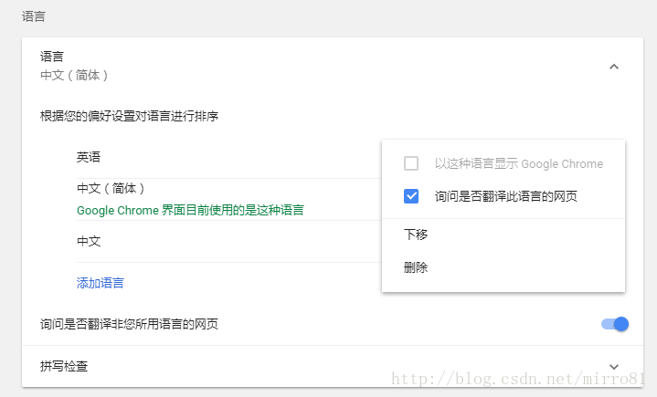
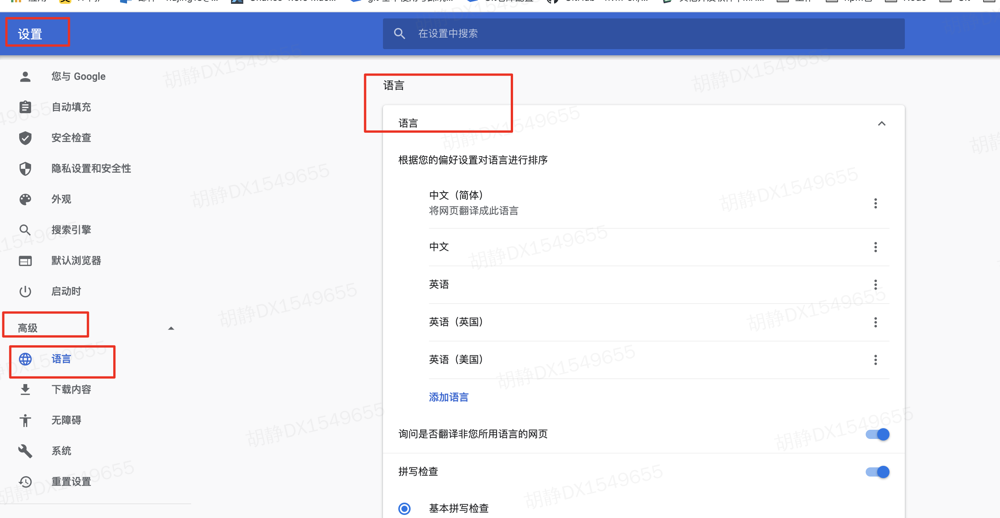
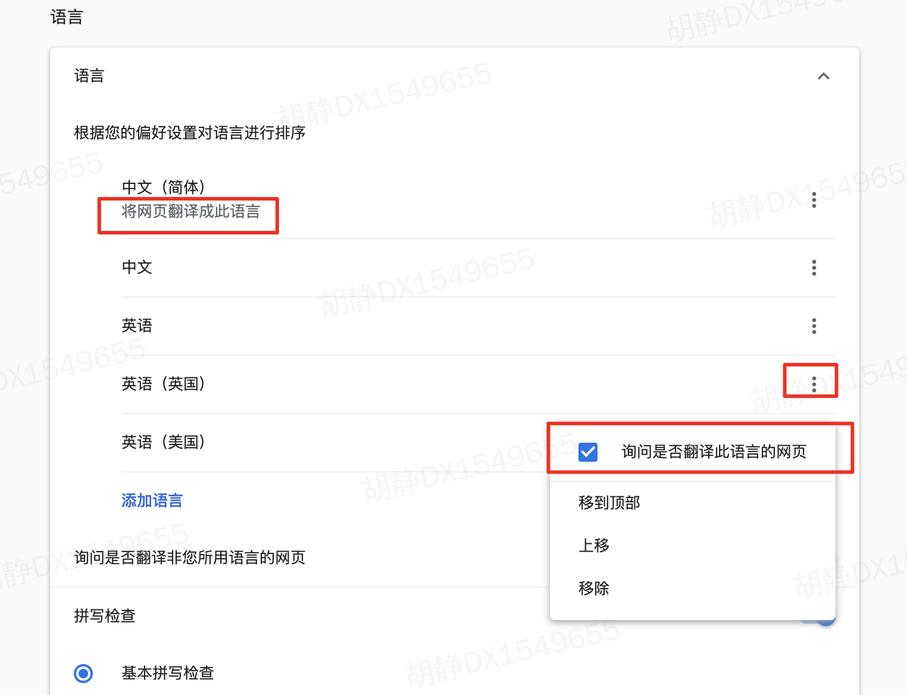

## lang属性

### 🍳 简介
搜索引擎首先自己无法判断自己抓取的页面中的内容是什么语言，因为在它看来都是二进制文件，那么这时就需要我们告诉它这个页面中的内容是什么语言，进而它才能知道下一步该干嘛，也就是说，当你把lang设置为”en”时，无论你网页中是什么语言的内容，在它看来都是英语，如果本地浏览器的默认语言不是英语，就会提示上面的选项，问您是否需要翻译。

<div style='margin-top: 20px'></div>

<div style='margin-top: 50px'></div>


### 🔧 用法
```js
// 可取值为
<!DOCTYPE html>
<html lang="en">
<head>
    <meta charset="UTF-8">
    <title></title>
</head>
<body></body>
</html>
```
<div style='margin-top: 50px'></div>


### ⚙️ chrome设置默认语言
浏览器会将读取到的页面语言和本地语言进行比较判断，如果一致，不做处理，否则提示是否需要翻译（当然前提是用户勾选了这个功能，chrome默认勾选）。设置默认语言的步骤如下：
<br>

#### step1: 打开chrome语言设置
  - 打开Chrome浏览器，在主界面右上角点击“三点标志”
  - 在下拉菜单中选择“设置”
  - 在“设置”界面中选择“高级设置”,再选择语言


<div style='margin-top: 40px'></div>


#### step2: 设置语言
  - 选择需要翻译成的最终语言，下标为“将网页翻译成此语言”
  - 选择需要被翻译的语言，并选择“询问是否翻译此语言的网站”


