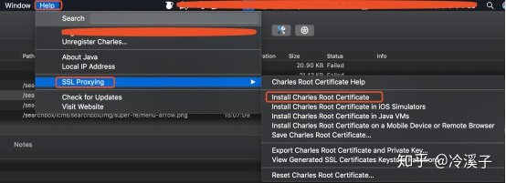
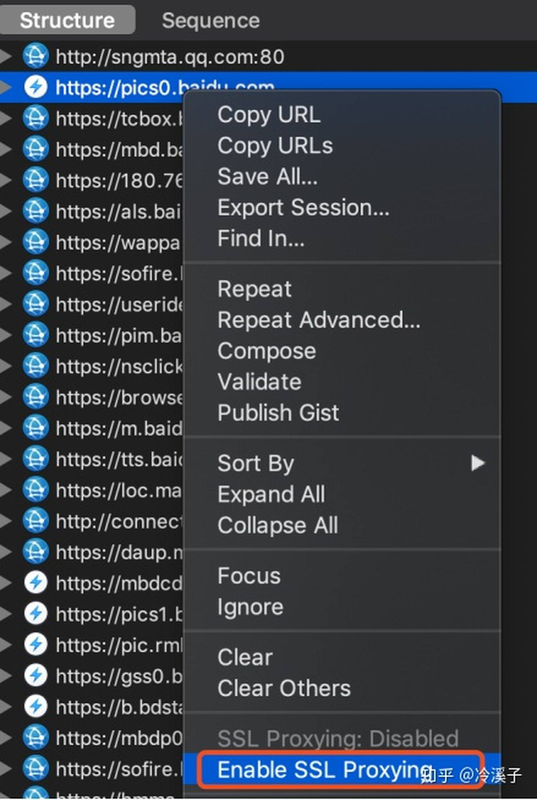
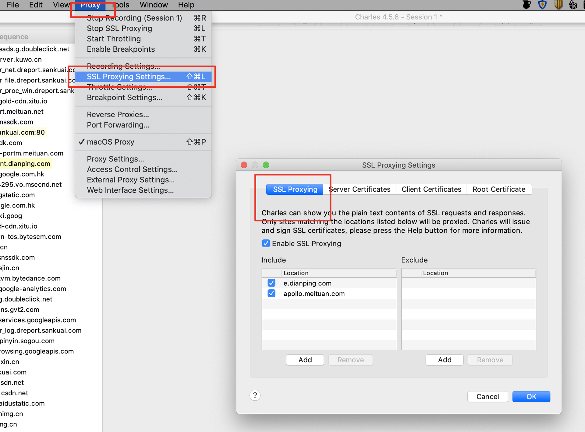
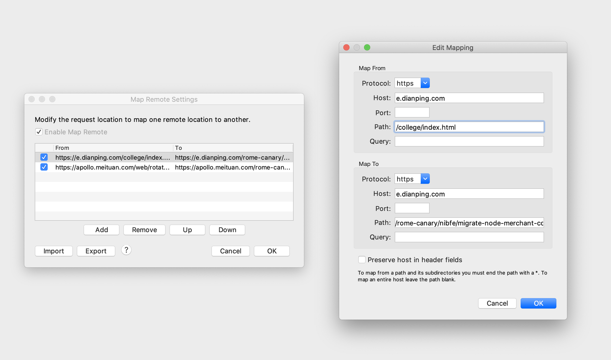

### 抓包工具
## charles
`mac` 环境为例
### 🍳 简介
`Charles` 是在 `Mac` 下常用的网络封包截取工具，在做移动开发时，我们为了调试与服务器端的网络通讯协议，常常需要截取网络封包来分析。

`Charles` 通过将自己设置成系统的网络访问代理服务器，使得所有的网络访问请求都通过它来完成，从而实现了网络封包的截取和分析。

除了在做移动开发中调试端口外，`Charles` 也可以用于分析第三方应用的通讯协议。配合 `Charles` 的 `SSL` 功能，`Charles` 还可以分析 `Https` 协议。

### 安装
#### 1. 下载
[Charles官网](www.charlesproxy.com)下载安装包，下载成功后根据指示安装即可

#### 2. 激活
::: tip
Charles激活码：
- Registered Name: https://zhile.io
- License Key: 48891cf209c6d32bf4
:::
打开 `Charles`，`help→Registered to`，输入账号和 `key` 提交破解成功就可以正常使用啦！

#### 3. 代理
`Proxy->macOC Proxy` 勾选，默认 `8888` 端口。代理状态以网络状态里面为准，`Charles` 某些时候会展示不正确

### HTTPS 代理设置
#### 1. 安装证书
`Help -> SSL Proxying -> Install Charles Root Certificate` -> 输入系统的帐号密码，即可在钥匙串中看到添加好的证书

#### 2. 信任证书
Mac本顶栏 前往 -> 实用工具 -> 打开钥匙串访问 -> 找到该证书 -> 双击或右键「显示简介」-> 点开「信任」-> 选择「始终信任」

#### 3. 允许 SSL proxying
`Charles` 默认并不抓取 `HTTPS` 网络通讯的数据，若想拦截所有 `HTTPS` 网络请求，需要进行设置：
- 方法一： 在请求上右击选择 `Enable SSL proxying`

- 方法二：`Charles -> Proxy -> SSL Proxying Settings -> SSL Proxying`「添加对应的域名和端口号，为方便也可端口号直接添加通配符 *

### Map Remote 功能
在 `Charles` 的菜单中，选择 `“Tools”–>“Map Remote”` 即可进入到相应功能的设置页面

对于 `Map Remote` 功能，我们需要分别填写网络重定向的源地址和目的地址，对于不需要限制的条件，可以留空。下图是一个示例，我将所有 `https://e.dianping.com/college/index.html` (原资源地址)的请求重定向到了 `https://e.dianping.com/rome-canary/nibfe/migrate-node-merchant-college-app-web/index.html`（灰度固定路径地址）

### 常见问题
#### 1. 报错SSL Proxying not enabled for this host:enable in Proxy Setting,SSL locations
未设置要抓包 `https` 域名, [详情](https://www.cnblogs.com/cynthia-wuqian/p/8327939.html)

### 🔗 相关链接
- [charles安装](https://juejin.cn/post/6844903733478817800)
- [charles使用详细教程](https://juejin.cn/post/6844903665304600589)
- [charles功能介绍](https://www.jianshu.com/p/fea896b0dee3)
- [charles使用教程](https://zhuanlan.zhihu.com/p/140942687)
- [markdown](http://tseven.top/2017/markdown/)

## whistle
`whistle` 是基于 `Node` 实现的跨平台 `web` 调试代理工具,[whistle -- 每天都要用的调试抓包小能手](https://juejin.cn/post/6963193590747463716)

### 1. 安装使用
- 安装whistle *npm install -g whistle*
- 启动 whistle *w2 start*
- 配置代理 默认代理服务器地址 *127.0.0.1*，代理端口 *8899*，`web` 端 推荐 `Chrome` 使用`SwitchOmega`,如图：

注意：使用 `SwitchOmega` 是因为 `whistle` 无法直接控制网页访问走自己启动的服务器，必须通过在浏览器端打开代理才能控制页面走某个 `SwitchOmega` 配置的服务器，即 `whistle` 启动的服务器

### 2. 配置和使用
#### 抓包
以上均配置好了以后，移动端或者 `web` 端访问的请求均可被抓包并查看详情

#### 配置代理转发
直接在 `Rules` 里面配置代理的转发，本地的项目地址为 `127.0.0.1:8080`，下面的配置将其转发到`www.test.com`， 访问 `www.test.com` 即可访问到本地项目,一般采用匹配模式代理转发

#### 本地替换
可以在访问某个请求的时候将返回值替换为本地的文件，表示接口为 `*.myysq.com.cn/park/get-park-info` 的返回内容匹配本地的 `base-info.json` 文件，可以替换数据，`mock` 我们想要的结果。同理，可以替换接口 `a` 的返回结果为接口 `b` 的返回接口，也可以替换 `html,css,js` 文件

#### 注入代码
在 `Whistle Values` 中编写需要注入的代码，可在页面访问时看到注入的代码，暂未遇到，不做讨论

