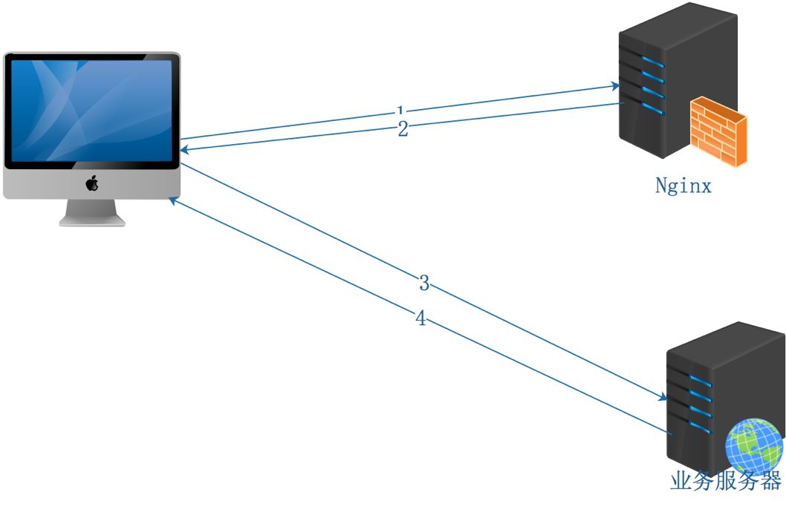

### URL重写
***

### 介绍
url重写是指通过配置conf文件，以让网站的url中达到某种状态时则定向/跳转到某个规则，比如常见的伪静态、301重定向、域名变更等
<div style='margin-top: 50px'></div>

### 原理
访问nginx服务器后给到新的资源地址，客户端再重新访问

<div style='margin-top: 50px'></div>

### 接入方法
1. **语法**
- 规则：可以是字符串或者正则来表示想匹配的目标url
- 定向路径：表示匹配到规则后要定向的路径，如果规则里有正则，则可以使用$index来表示正则里的捕获分组
- 重写类型：
  - last ：相当于Apache里德(L)标记，表示完成rewrite，浏览器地址栏URL地址不变
  - break；本条规则匹配完成后，终止匹配，不再匹配后面的规则，浏览器地址栏URL地址不变
  - redirect：返回302临时重定向，浏览器地址会显示跳转后的URL地址。对旧网址没有影响，但新网址不会有排名
  - permanent：返回301永久重定向，浏览器地址栏会显示跳转后的URL地址。新网址完全继承旧网址，旧网址的排名等完全清零
```js
server {
  rewrite 规则 定向路径 重写类型;
}
```
<div style='margin-top: 30px'></div>

2. **last标志**

url重写后，马上发起一个新的请求，再次进入server块，重试location匹配，超过10次匹配不到报500错误，地址栏url不变
```js
location / {
  rewrite ^/test1 /test2;
  rewrite ^/test2 /test3 last;
  rewrite ^/test3 /test4;
}
location /test2 {
  return 401;
}
location /test3 {
  return 402;
}
location /test4 {
  return 403;
}
```
`http://192.168.199.328/test1` 匹配到 `location / {}`后，被重写为`/test2`，顺序执行再次被重写为`/test3`，因为`flag`为`last`，所以不会继续重写为`/test4`，而是发起一次location匹配，匹配到`location /test3{}`，所以最终返回结果为402;

如果把`location /{}`中的`last`改为`break`，被重写为`/test3`后，不再重写为`/test4`，也不会发起`location`，最终没有可匹配的资源，返回`http`404。
<div style='margin-top: 30px'></div>

3. **break标志**

用于停止执行rewrite模块的指令，但是其他模块不受影响
```js
 location / {
  if ($http_user_agent ~* 'Chrome') {
    break;
    return 403;
  }
  rewrite ^/$ http://www.cnblogs.com permanent ;
}
```
如果浏览器是`chrome`浏览器则返回403,但这里加了`break`,就不会执行`return 403`，返回默认的`index`,
，也不会返回博客园
<div style='margin-top: 30px'></div>

4. **return**

如果浏览器是`chrome`浏览器则返回403，其他浏览器返回博客园网址
```js
location / {
  root html;
  index index.html index.htm;
  if ($http_user_agent ~* 'Chrome') {
    return 403;
  }
  rewrite ^/$ http://www.cnblogs.com permanent ;
}
```
<div style='margin-top: 30px'></div>

5. **if语句**

- 匹配符号：
  - ~区分大小写正则匹配；
  - ~*不区分大小写正则匹配；
  - !~区分大小写正则不匹配；
  - !~*不区分大小写正则不匹配；
  - 直接比较变量和内容时，使用=或!=

​- 运算符：
- 使用“ -f”和“ !-f”运算符检查文件是否存在;
- 使用“ -d”和“ !-d”运算符检查目录是否存在;
- 使用“ -e”和“ !-e”运算符检查文件，目录或符号链接是否存在;
- 使用“ -x”和“ !-x”运算符检查可执行文件。

```js
server {
  # 如果文件不存在则返回400
  if (!-f $request_filename) {
    return 400;
  }
    
  #如果浏览器是chrome浏览器则返回403
  if ($http_user_agent ~* 'Chrome') {
    return 403;
    #return http://www.cnblogs.com;
  }
    
  # 如果请求类型不是POST则返回405
  if ($request_method = POST) {
    return 405;
  }
    
  # 如果参数中有 a=1 则301到指定域名
  if ($args ~ a=1) {
    rewrite ^ http://example.com/ permanent;
  }
}
```

:::details 内置预定义变量
- $arg_PARAMETER  GET请求中变量名PARAMETER参数的值。
- $args   这个变量等于GET请求中的参数。例如，foo=123&bar=blahblah;这个变量只可以被修改
- $binary_remote_addr 二进制码形式的客户端地址。
- $body_bytes_sent    传送页面的字节数
- $content_length 请求头中的Content-length字段。
- $content_type   请求头中的Content-Type字段。
- $cookie_COOKIE  cookie COOKIE的值。
- $document_root  当前请求在root指令中指定的值。
- $document_uri   与$uri相同。
- $host   请求中的主机头(Host)字段，如果请求中的主机头不可用或者空，则为处理请求的server名称(处理请求的server的server_name指令的值)。值为小写，不包含端口。
- $hostname   机器名使用 gethostname系统调用的值
- $http_HEADER    HTTP请求头中的内容，HEADER为HTTP请求中的内容转为小写，-变为_(破折号变为下划线)，例如：$http_user_agent(Uaer-Agent的值);
- $http_user_agent ： 客户端agent信息;
- $http_cookie ： 客户端cookie信息;
- $sent_http_HEADER   HTTP响应头中的内容，HEADER为HTTP响应中的内容转为小写，-变为_(破折号变为下划线)，例如： $sent_http_cache_control, $sent_http_content_type…;
- $is_args    如果$args设置，值为"?"，否则为""。
- $limit_rate 这个变量可以限制连接速率。
- $nginx_version  当前运行的nginx版本号。
- $query_string   与$args相同。
- $remote_addr    客户端的IP地址。
- $remote_port    客户端的端口。
- $remote_user    已经经过Auth Basic Module验证的用户名。
- $request_filename   当前连接请求的文件路径，由root或alias指令与URI请求生成。
- $request_body   这个变量（0.7.58+）包含请求的主要信息。在使用proxy_pass或fastcgi_pass指令的location中比较有意义。
- $request_body_file  客户端请求主体信息的临时文件名。
- $request_completion 如果请求成功，设为"OK"；如果请求未完成或者不是一系列请求中最后一部分则设为空。
- $request_method 这个变量是客户端请求的动作，通常为GET或POST。包括0.8.20及之前的版本中，这个变量总为main request中的动作，如果当前请求是一个子请求，并不使用这个当前请求的动作。
- $request_uri    这个变量等于包含一些客户端请求参数的原始URI，它无法修改，请查看$uri更改或重写URI,
包含请求参数的原始URI，不包含主机名，如：”/foo/bar.php?arg=baz”。
- $scheme 所用的协议，比如http或者是https，比如rewrite ^(.+)$ $scheme://example.com$1 redirect;
- $server_addr    服务器地址，在完成一次系统调用后可以确定这个值，如果要绕开系统调用，则必须在listen中指定地址并且使用bind参数。
- $server_name    服务器名称。
- $server_port    请求到达服务器的端口号。
- $server_protocol    请求使用的协议，通常是HTTP/1.0或HTTP/1.1。
- $uri    请求中的当前URI(不带请求参数，参数位于args)，不同于浏览器传递的args)，不同于浏览器传递的args)，不同于浏览器传递的request_uri的值，它可以通过内部重定向，或者使用index指令进行修改。
:::

<div style='margin-top: 30px'></div>

6. **set设置变量**

访问主机`ip`本来应该进入`http://www.cnblogs.com`  重写为 `http://www.cnblogs.com/Nicholas0707`
```js
location / {
  set $name Nicholas0707;
  rewrite ^(.*)$ http://www.cnblogs.com/$name;
}
```
<div style='margin-top: 50px'></div>

### 🔗相关链接
- [URL重写介绍](https://www.cnblogs.com/Nicholas0707/p/12210551.html)
- [组团学](https://www.zutuanxue.com/home/4/54_284)