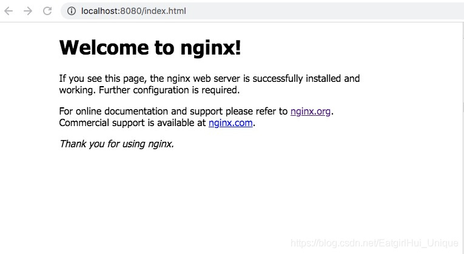
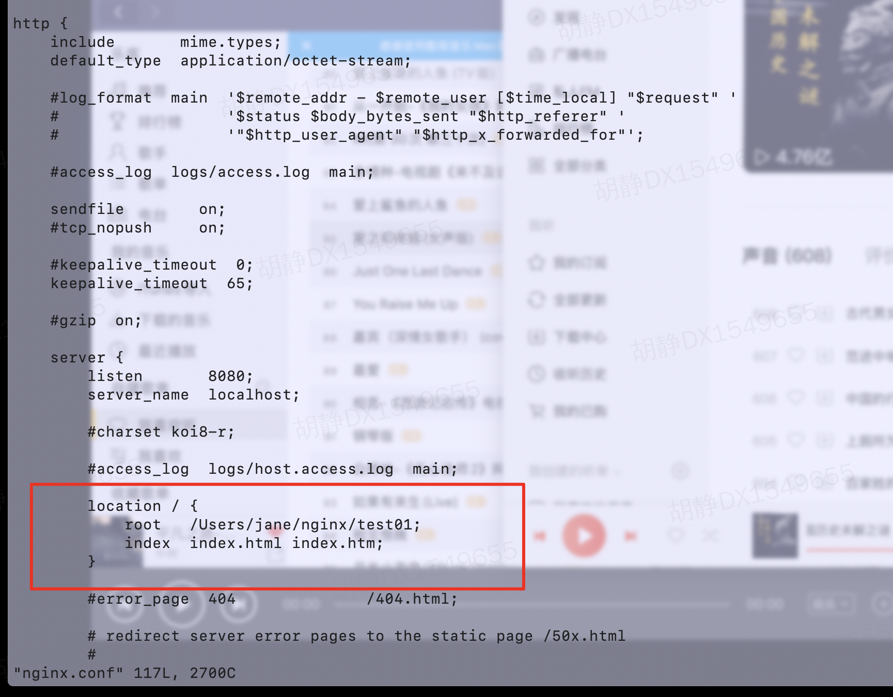
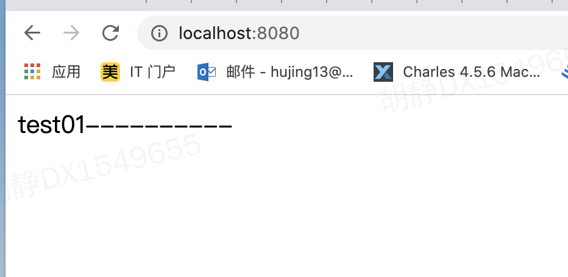

### 安装部署（mac环境）
***

### 🍳 简介
Nginx是一款轻量级的Web服务器、反向代理服务器，由于它的内存占用少，启动极快，高并发能力强，在互联网项目中广泛应用。
<div style='margin-top: 50px'></div>

### 🏠 nginx 本地安装
1. 安装homebrew
```js
打开官网安装：[homebrow官网](https://brew.sh/)
确认是否安装成功：brew -v
```

2. 安装niginx
```js
brew install nginx
确认是否安装成功：nginx -v
```

3. 启动服务
```js
sudo nginx
```
<div style='margin-top: 30px'></div>

检查nginx是否启动成功，在浏览器输入：localhost:8080；
若成功，则显示nginx欢迎页面，如下：

<div style='margin-top: 50px'></div>


### 📡 nginx 部署
1. 新建项目
<br>在本地新建项目，在本地 `/Users/jane/nginx/test01` 下新建 `index.html`

2. 修改配置
```js
vim  /usr/local/etc/nginx/nginx.conf
```
进入nginx.conf页面后, 自定义端口和映射本地路径如下:


3. 启动 nginx
```js
sudo nginx -s reload
```
即可看到页面效果：<br>



### 🔗相关链接
- [nginx安装部署](https://blog.csdn.net/EatgirlHui_Unique/article/details/106288494)
- [nginx介绍](https://www.zutuanxue.com/home/4/54_278)