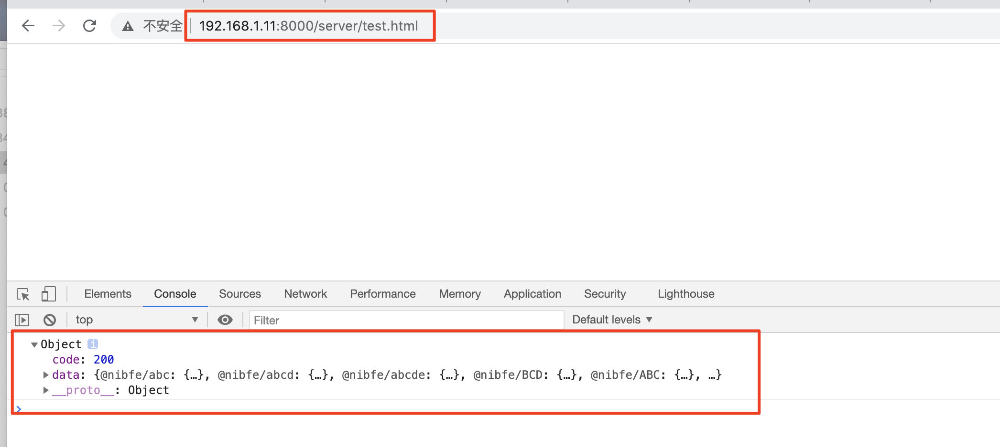

### anywhere - 静态文件服务器

### 🍳简介
随时随地将你的当前目录变成一个静态文件服务器的根目录。

### 🏠适用场景
模拟在服务器中启动文件，对于跨域场景，可以模拟在浏览器中启动.html文件，发出http请求，检查是否存在跨域问题。

### 🔧快速使用
- step1 安装anywhere
```js
yarn global add anywhere
或
npm install anywhere -g
```

- step2 建立请求文件.html
```js
<!DOCTYPE html>
<html lang="en">
<head>
    <meta charset="UTF-8">
    <meta name="viewport" content="width=device-width, initial-scale=1.0">
    <meta http-equiv="X-UA-Compatible" content="ie=edge">
    <title>Document</title>
</head>
<script>
    fetch('http://localhost:8080/getBannedPackages')
    .then(function(response) {
        return response.json();
    })
    .then(function(myJson) {
        console.log(myJson);
    });
</script>
<body>   
</body>
</html>
```

- step3 启动服务器
```js
// 在想启动文件的目录下执行
anywhere
```

- step4 打开启动文件，检查是否存在跨域



### 🔗相关链接
- [anywhere官网](https://www.npmjs.com/package/anywhere)
- [Web api接口-fetch](https://developer.mozilla.org/zh-CN/docs/Web/API/Fetch_API/Using_Fetch)