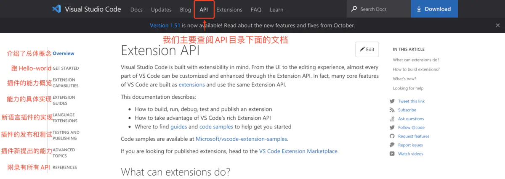
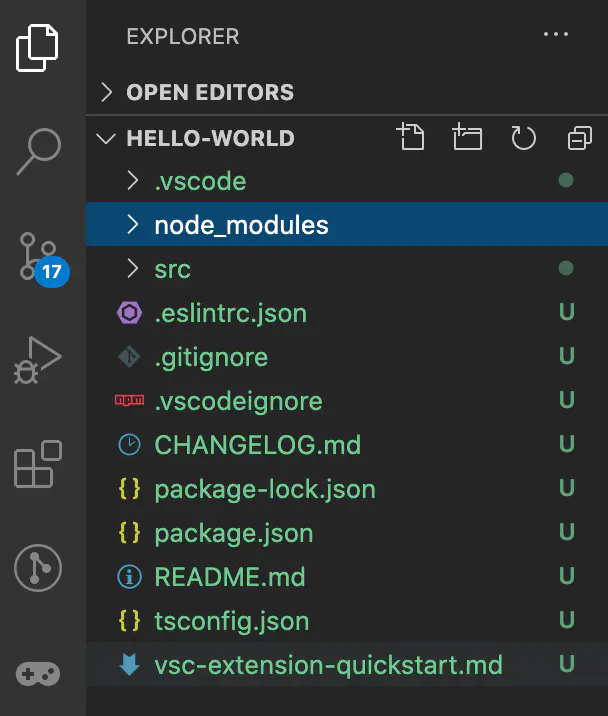
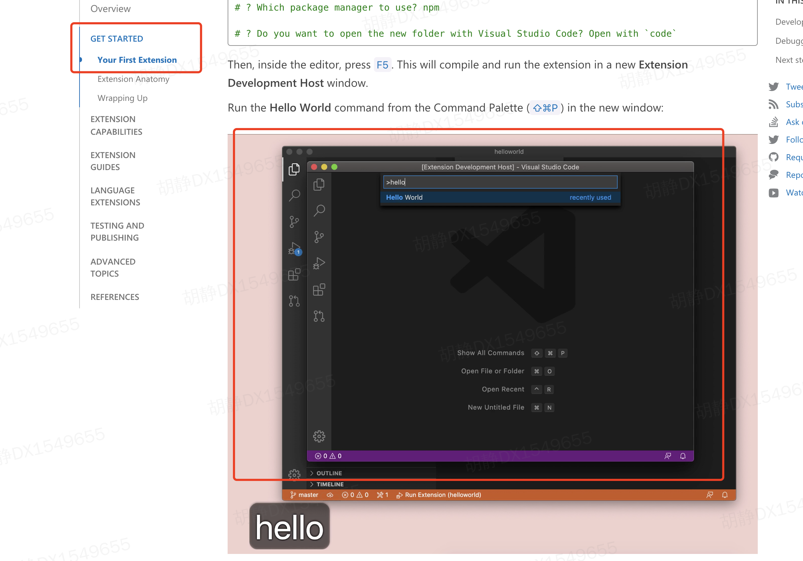
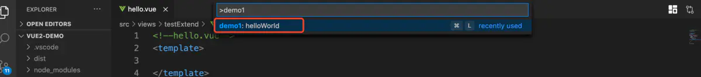
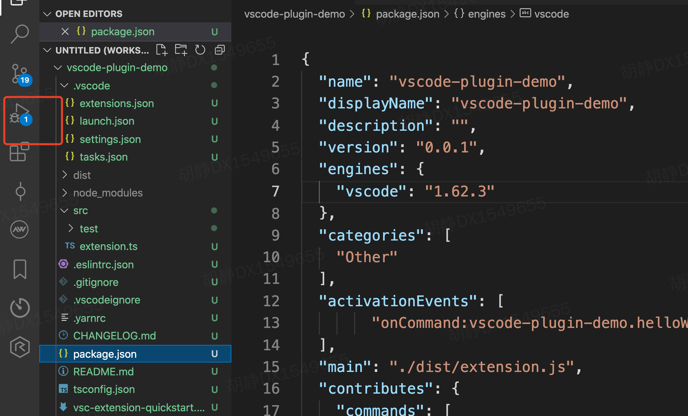

### Hello world

`vscode` 是微软 `2015` 年推出的一款轻量级的代码编辑器，最大的优点是开源的生态。在保证 `vscode` 基本的功能的同时，其他的功能通过插件的形式对 `vscode` 进行拓展。既保证了编辑器的轻量级，又保证了功能的适用性

#### 1. 官方文档
[官方文档地址](https://code.visualstudio.com/api), 插件开发的主要内容在 `API` 中
<p>
  
</p>


#### 2. 搭建项目
```js
// 安装脚手架
yarn global add yo generator-code
// 创建项目
yo code
```
根据个人开发需求选择不同类型的插件:
```js
New Extension (TypeScript)  // 不明确是哪种类型的插件 使用TypeScript开发
New Extension (JavaScript)  // 不明确是哪种类型的插件 使用JavaScript开发
New Color Theme  // 生成专为主题插件开发的目录
New Language Support // 生成专为语言插件开发的目录
New Code Snippets // 生成专为代码片段插件开发的目录
New Keymap // 生成专为快捷键插件开发的目录
New Extension Pack // 生成打包功能的插件
New Language Pack (Localization) // 生成新的语言打包功能的插件
```

选择插件类型后需要填写新建插件的相关信息: 
```js
? What type of extension do you want to create? New Extension (TypeScript) 
? What's the name of your extension? hello-world // 插件名字
? What's the identifier of your extension? hello-world // 插件标识符
? What's the description of your extension? hello-world // 插件描述
? Initialize a git repository? Yes // 是否帮你初始化一个git仓库
? Which package manager to use? (Use arrow keys) // 使用什么包管理器
❯ npm 
  yarn
```

当你做完上面的步骤，`Yeoman` 会在当前目录下生成一个项目，目录结构如下:
<p>
  
</p>

#### 3. 目录结构分析
基本的目录结构如下:

```js
├── .vscode
│   ├── launch.json     // 插件加载和调试的配置
│   └── tasks.json      // 配置TypeScript编译任务
├── .gitignore          // 忽略构建输出和node_modules文件
├── README.md           // 一个友好的插件文档
├── src
│   └── extension.ts    // 插件入口文件
├── package.json        // 插件配置清单
├── tsconfig.json       // TypeScript配置
```

重点关注两个文件 `extension.ts` 和 `package.json`, `extension.ts` 是整个插件的入口文件，当你的插件启动的时候就会首先走这里的逻辑，首先引入了 `vscode` 实例对象，该对象是 `vscode` 暴露给开发者调用 `vscode API` 使用的，换句话说，是通过这个对象进行调用对应的 `api` 进行我们插件的二次开发。然后里面有两个钩子函数：
- **activate**: 钩子函数是插件激活的时候启动，可以在这个钩子函数里面定义插件的启动时候相关的逻辑
- **deactivate**: 钩子函数是插件失活的时候触发的钩子函数，比如插件关闭的时候需要清理不需要的引用，你可以在这个函数中手动清除

```js
// extension.ts
import * as vscode 'vscode';
export function activate(context: vscode.ExtensionContext) {
}
export function deactivate() {
}
```

`package.json` 也新增了一些字段，这里只简略介绍，后面会专门有小节讨论

```js
{
  "name": "hello-world",
  "displayName": "hello-world",
  "publisher"："mss-plugin"
  "description": "hello-world",
  "version": "0.0.1",
  "engines": {
      "vscode": "^1.51.0"
  },
  "categories": [
      "Other"
  ],
  "activationEvents": [ 
  ],
  "main": "./out/extension.js",
  "contributes": {
  },
  "scripts": {
  },
  "devDependencies": {  
  }
}
```
- **publisher**: 表示发布的时候生成的私有名字，这个字段的值就是你在 `vscode` 应用市场发布的插件的名字
- **engines**: 表示你使用的 `vscode` 引擎的版本，不同的版本 `API` 的使用方式可能会有所异同
- **activationEvents**: 配置触发 `extendion.js` 文件中 `active` 钩子函数的事件
- **contributes**: 是对插件的一些配置，比如图标，菜单等。


#### 4. 启动 Hello World
在官网中可以看到这个例子的实际效果，
<p>
  
</p>

##### 4.1 注册命令
首先入口文件 `extendion.ts` 的插件激活函 `activate` 中注册一个命令，并定义好触发命令时 `vscode` 调用的回调函数

```js
export function activate(context: vscode.ExtensionContext) {
    vscode.commands.registerCommand('vsplugin.helloWorld', () => {
        vscode.window.showInformationMessage('Hello World');
    });
}
```
其中, `context: vscode.ExtensionContext` 这里的`vscode` 就是 `vscode` 官方提供给我们调用它的所有 `API` 的实例。`vscode.commands.registerCommand` 注册了一个命令，第一个参数表示命令名称，第二个表示命令回调函数。`vscode.window.showInformationMessage` 定义了一个弹窗


##### 4.2 配置命令
上述仅仅是注册了一个命令和指定了命令的回调函数，我们的命令还没有出现在控制面板中，所以我们还需要配置 `package.json` 文件

```js
{
  "contributes": {
    "commands": [
      {
        "command": "vsplugin.helloWorld", // 和extension 中注册的命令保持一致
        "title": "Hello World", // 命令名称
        "category": "Hello", // 命令分类
      }
    ]
  }
}
```

当我们在 `package.json` 中配置后，使用 `command + shift + p` 打开命令面板就可以看到我们这个命令了：
<p>
  
</p>

##### 4.3 定义触发时机
面板中有了命令，但是还没有定义什么时候去触发我们的 `extension.ts` 中的 `active` 钩子函数，因为只有触发了这个钩子函数，我们才能触发里面命令对应的回调函数, 这里选择 `onCommand` 表示键入命令的时候才激活钩子函数

```js
// package.json
"activationEvents": [
  "onCommand:vsplugin.helloWorld"
],
```

##### 4.4 调试
首先点击调试按钮，打开新的 `vscode` 窗口, 然后在弹出的调试的 `vscode` 的窗口 `command + shift +p`
<p>
  
</p>

[示例代码](https://github.com/Janehuhuhu/vscode-plugin-demo)