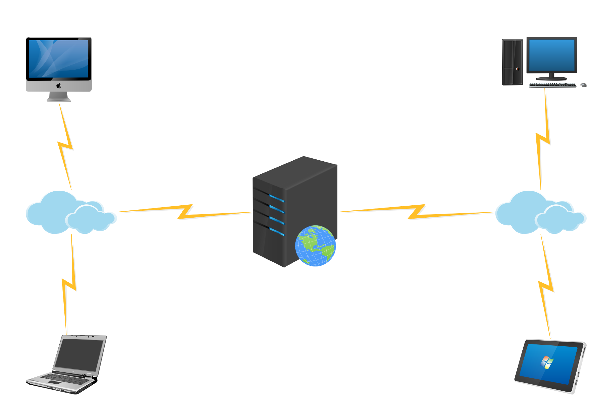
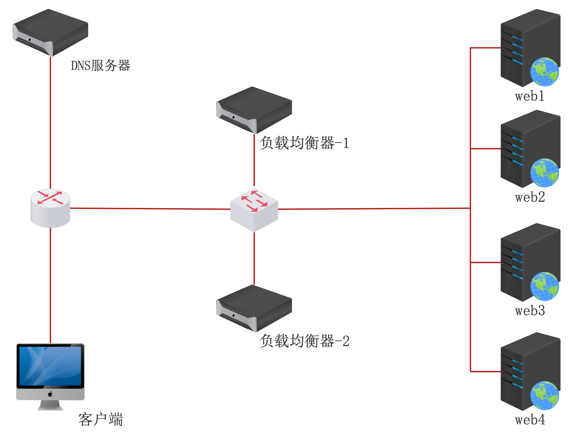

## 集群介绍
### 传统web访问模型

<br>

**1. 完成一次请求的步骤**<br>
1）用户发起请求<br>
2）服务器接受请求<br>
3）服务器处理请求（压力最大）<br>
4）服务器响应请求<br>

**2. 传统模型缺点**
- 单点故障
- 单台服务器资源有限（客户端则是无限的）；
- 单台服务器处理耗时长（客户等待时间过长）；

**3. 传统模型优化——单点故障解决方案**<br>
部署一台备份服务器，宕机直接切换该方案可以有效解决服务器故障导致的单点故障，但且服务器利用率低、成本高，切换不及时，且无法解决服务器业务压力问题。
<div style='margin-top: 50px'></div>

### 集群模式

<div style='margin-top: 30px'></div>

​两台负载均衡主机一个为主服务器，另外一个为备用服务器，他们，正常情况下，主服务器会绑定一个虚IP（Virtual IP），`DNS`将域名解析为虚拟`IP`，客户端的请求到达负载均衡器后，由负载均衡将请求交给后端的web服务器，如果主服务器宕机，则备用服务器会自动绑定这个虚拟IP，继续进行分发工作，这一切对于用户而言是透明的

​**优点**： 不需要调整`dns`服务器，因为是用过相应的软件来实现负载均衡的，并且只需要一个公网`IP`地址做为虚拟`IP`就可以了，还能做到随时扩容，如果后端的`web`服务器宕机，负载均衡器会将其从分发列表里剔除，真正的实现的网站的高度可用，因为负载均衡器有备用服务机，`web`服务器也有备用机

**缺点**： 软件上和硬件上都可以实现负载均衡，选择的时候要慎重，硬件上的设备需要资金投入，软件上的要根据自己的需求决定，如`LVS`不能实现动静分离；`NGINX`适用范围小，只能支持http，https等少数的协议；`HAProxy`不支持`POT/SMTP`协议，多进程模式不够好等。

<div style='margin-top: 80px'></div>

## nginx集群原理
- 在Nginx集群中Nginx扮演的角色是：分发器

- 任务：接受请求、分发请求、响应请求

- nginx集群的实质
nginx 默认支持分发 他有一个自带模块 叫 `upstream` 这就是 `nginx` 的分发模块，也就是说 `nginx` 分发是一个组合体，虚拟主机+反向代理+upstream，在这个组合中：
  - 虚拟主机：负责接受和响应请求。
  - 反向代理：带领用户去数据服务器拿数据。
  - upstream：告诉nginx去哪个数据服务器拿数据。
  
- 数据包走向

​ 1）用户发起请求<br>
​ 2）虚拟主机接受用户请求<br>
​ 3）虚拟主机去找反向代理（问反向代理去哪拿数据）<br>
​ 4）反向代理让去找upstream<br>
​ 5）upstream告诉一个数据服务器IP<br>
​ 6）Nginx去找数据服务器，并发起用户的请求<br>
​ 7）数据服务器接受请求并处理请求<br>
​ 8）数据服务器响应请求给Nginx<br>
​ 9）Nginx响应请求给用户
<div style='margin-top: 80px'></div>


## nginx分发算法
### 介绍
如何将用户请求按照一定的规律分发给业务服务器。主要分为Nginx集群默认算法和基于请求头分发算法。

### nginx集群默认算法
#### 轮询算法(默认)
每个请求按时间顺序逐一分配到不同的后端服务器，如果后端服务器 `down` 掉，能自动剔除。用于处理静态页面
```js
upstream web {
  server 192.168.0.42; 
  server 192.168.0.43;
}
server {
  listen 80;
  server_name localhost; 
  location / {
    proxy_pass http://web;
  } 
}
```
```js
# 42机器down时访问43机器
upstream web {
  server 192.168.0.42; 
  server 192.168.0.43 backup;
}
server {
  listen 80;
  server_name localhost; 
  location / {
    proxy_pass http://web;
  } 
}
```
<div style='margin-top: 30px'></div>

#### 基于权重
指定权重，数值大的服务器，获得的请求的数量越多，用于后端服务器性能不均的情况。用于处理静态页面
```js
# 通过配置权重，可以让性能好的服务器承担更多的负载
upstream web {
  # 设置权重比例1:2
  server 192.168.0.42 weight=1; 
  server 192.168.0.43 weight=2;
}
server {
  listen 80;
  server_name localhost; 
  location / {
    proxy_pass http://web;
  } 
}
```
<div style='margin-top: 30px'></div>

#### 基于ip_hash分发
每个请求按访问ip的hash结果分配，这样每个访客固定访问一个后端服务，好处是可以解决session的问题。可以处理动态网站。
```js
# ip_hash算法能够保证来自同样源地址的请求都分发到同一台主机。需要注意：ip_hash算法不支持backup、weight设置。默认权重为1。
upstream web { 
  ip_hash;    # 指定ip_hash即可，默认weight权重比例1: 1
  server 192.168.0.42;
  server 192.168.0.43; 
}
server { 
  listen 80;
  server_name localhost; 
  location / {
    proxy_pass http://web;
  } 
}
```
<div style='margin-top: 30px'></div>

#### 基于url的hash
按访问url的hash结果来分配请求，使每个url定向到同一个后端服务 ，后端服务器为缓存时比较有效。
```js
# 不同的URL我去找不同的机器访问，就是把url计算出一个值然后除以机器的数量取余 ，需要安装第三方插件
worker_processes  1;
events {
  worker_connections  1024;
}
http {
  include       mime.types;
  default_type  application/octet-stream;
  sendfile        on;
  keepalive_timeout  65;
  upstream web {
    consistent_hash $request_uri;
    server 192.168.0.42 ;
    server 192.168.0.43 ;
  }
  server {
    listen       80;
    server_name  localhost;
    location / {
      proxy_pass http://web;
    }
    error_page   500 502 503 504  /50x.html;
    location = /50x.html {
      root   html;
    }
  }
}
```
<div style='margin-top: 80px'></div>


## nginx基于请求头的分发
### 介绍
前面的分发方式都是基于一个集群分发的，nginx是一个基于7层的分发也就是可以实现基于主机头的分发，这种分发一般都是用于多集群环境中。
<div style='margin-top: 50px'></div>

### 基于请求头分发算法
#### 基于host分发
基于 `host` 分发这种分发方式适用于多集群分发。例如：一个公司有多个网站，每个网站就是一个集群。
```js
#nginx分发器设置
http {
  upstream web1 {   # 名为web1的反向代理群组
    server 192.168.0.42;
  }
  upstream web2 {   # 名为web2的反向代理群组
    server 192.168.0.43;
  }
  server {    # web1虚拟主机
    listen 80;
    server_name www.web1.com;    # 基于域名分发必须有域名
    location / {
      proxy_pass http://web1; 
    }
  }
  server {    # web2虚拟主机
    listen 80;
    server_name www.web2.com;    # 基于域名分发必须有域名 
    location / {
      proxy_pass http://web2; 
    }
  }
}
```
<div style='margin-top: 30px'></div>

#### 基于开发语言分发
这种分发方式适用于混合开发的网站，某些大型网站既有 `php` 也有 `jsp` ，就可以基于开发语言分发。
```js
http {
  upstream php {
    server 192.168.0.42; 
  }
  upstream html {
    server 192.168.0.43;
  }
  server {
    location ~* \.php$ {    # 以php结尾的
      proxy_pass http://php;
    } 
    location ~* \.html$ {   # 以html结尾的
      proxy_pass http://html;
    }
  }
}
```
<div style='margin-top: 30px'></div>

#### 基于浏览器分发
这种基于浏览器的分发，常应用于 `PC` 端和移动端区分或浏览器适配。
```js
upstream curl { server 192.168.0.42; }
upstream firefox { server 192.168.0.43; }
upstream other { server 192.168.0.44; }
server {
  listen 80;
  server_name www.web1.com;
  location / {
    proxy_pass http://other;
    if ( $http_user_agent ~* curl ) {
      proxy_pass http://curl;
    }
    if ( $http_user_agent ~* firefox ) {
      proxy_pass http://firefox;
    }
  }
}
```
<div style='margin-top: 30px'></div>

#### 基于源IP分发
像腾讯新闻，网易，58同城，真爱，百合，赶集，智联等等很多网站,这种网站都有一个特性，你一访问，就知道你的位置，然后根据你的位置，给你推荐或者展示相关内容。也就是说我们可以让服务器对源 `IP` 进行判断，根据判断的结果不同，再返回不同的数据给客户端；如果判断不出来，就按照默认去处理。如果想实现基于源 `IP` 的分发我们需要一个叫 `geo` 的参数，这个参数可以要根据客户端 `ip` 访问到不同的 `server`，它是通过一个叫`ngx_http_geo_module` 模块提供的。

```js
upstream bj.server {
  server 192.168.0.42;    # web01
}
upstream sh.server {
  server 192.168.0.43;      # web02
}
upstream default.server {
  server 192.168.0.44;      # web03
}
geo $geo {       # IP库
  default default;
  192.168.0.10/32 bj;    # 北京
  192.168.0.20/32 sh;   # 上海
}
server {
  listen  80;
  server_name   www.web1.com;

  location / {
    proxy_pass http://$geo.server$request_uri;
  }
}
```
如果客户端地址是 *0.10* 就访问北京，如果是 *0.20* 就访问上海，如果不是 *0.10* 也不是 *0.20* 就按照 `default` 处理，线上环境这里面就是个 `IP` 库 我现在没有 `ip` 库只能写两个 `IP` 来代表看下后面的掩码是32表示这一个网段只有这一个 `IP` 吧，当然你也可以换成网段。

`http` 后面加上 `$request_uri` 的原因就是避免客户 找你拿数据的时候一指定 `URI` 你就无法正常代理了，目的就是保证客户在访问类似 `http://www.a.com/a/b/c/d.jpg` 这样的网址的时候可以正常访问 也就是说当用户请求的 `URL` 当中的 `URI` 跟着变化的时候你的代理服务器一样可以正常工作
<div style='margin-top: 50px'></div>

### 🔗相关链接
[组团学](https://www.zutuanxue.com/home/4/9_393)