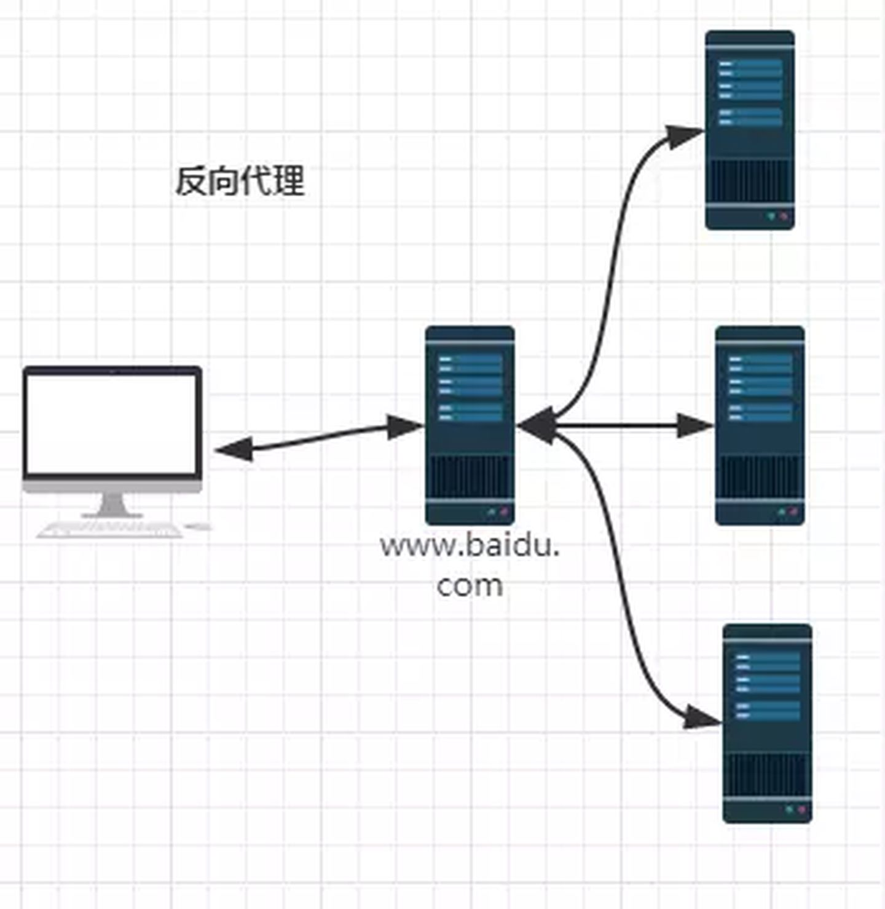
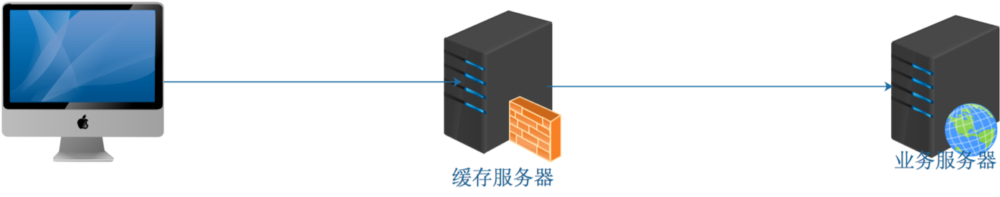

### 反向代理
***

### 介绍
代理在网络中使用是比较常见的，比如我们说的最多的就是翻墙软件，比如ss、蓝灯等这些大家常用的软件，他们就是能改代理大家访问国内无法访问的一些国外网站，比如facebook、YouTube等网站。其原理也比较简单：<br>
1）用户将请求发给代理服务器<br>
2）代理服务器代用户去访问数据<br>
3）代理服务器将数据给用户<br>

代理服务器扮演的就是一个中间人的角色。代理分为正向代理和反向代理两种类型：
- 正向代理：由于防火墙的原因，我们并不能直接访问谷歌，那么我们可以借助VPN来实现，这就是一个简单的正向代理的例子。这里你能够发现，正向代理“代理”的是客户端，而且客户端是知道目标的，而目标是不知道客户端是通过VPN访问的<br>


- 反向代理：当我们在外网访问百度的时候，其实会进行一个转发，代理到内网去，这就是所谓的反向代理，即反向代理“代理”的是服务器端，而且这一个过程对于客户端而言是透明的。<br>


<div style='margin-top: 50px'></div>

### 应用场景
1. 堡垒机：堡垒机承担所有的外部访问，保护后端服务器的安全。因为数据都在后端服务器上，即使代理服务器被黑了，也无法获取数据资源<br>

<br>

2. 业务发布服务器：将多个服务器通过虚拟主机的方式发布到公网，如适用于只有一个`IP`的场景<br>

<br>

3. 缓存服务器：CDN加速，如将静态资源放在代理服务器上，动态资源通过代理服务器再去访问<br>

<div style='margin-top: 60px'></div>


### 反向代理原理

1）客户端通过浏览器发起请求代理服务器<br>
2）代理服务器接受请求<br>
3）代理服务器发起请求业务服务器<br>
4）业务服务器接受请求<br>
5）业务服务器处理请求<br>
6）业务服务器响应请求代理服务器<br>
7）代理服务器响应请求客户端<br>
8）客户端通过浏览器渲染请求并展示给用户<br>
<div style='margin-top: 50px'></div>


### 接入方式
```js
location / {
  index index.php index.html index.htm; #定义首页索引文件的名称
  proxy_pass http://mysvr ;   #请求转向mysvr 定义的服务器列表

}
```

:::details 反向代理优化
proxy_set_header Host $host;   #修改请求头，添加Host字段

proxy_set_header X-Real-IP $remote_addr;   #修改请求头，添加X-Real-IP字段

proxy_set_header X-Forwarded-For $proxy_add_x_forwarded_for;   #修改请求头，添加X-Forwarded-For字段

client_max_body_size 10m;    #允许客户端请求的最大单文件字节数

client_body_buffer_size 128k;  #缓冲区代理缓冲用户端请求的最大字节数，

proxy_connect_timeout 90;  #nginx跟后端服务器连接超时时间\(代理连接超时\)

proxy_send_timeout 90;        #后端服务器数据回传时间\(代理发送超时\)

proxy_read_timeout 90;         #连接成功后，后端服务器响应时间\(代理接收超时\)

proxy_buffer_size 4k;             #设置代理服务器（nginx）保存用户头信息的缓冲区大小

proxy_buffers 4 32k;               #proxy_buffers缓冲区，网页平均在32k以下的话，这样设置

proxy_busy_buffers_size 64k;    #高负荷下缓冲大小（proxy_buffers*2）

proxy_temp_file_write_size 64k;  #设定缓存文件夹大小，大于这个值，将从upstream服务器传

:::
<div style='margin-top: 50px'></div>

### 🔗相关链接
- [深入浅出nginx](https://zhuanlan.zhihu.com/p/34943332)