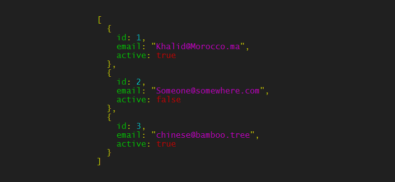
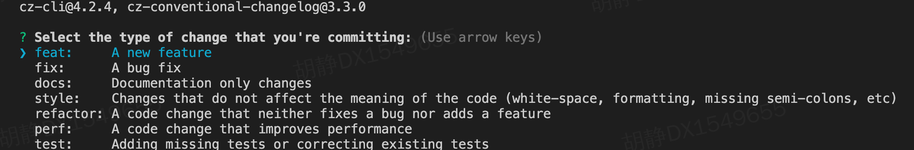
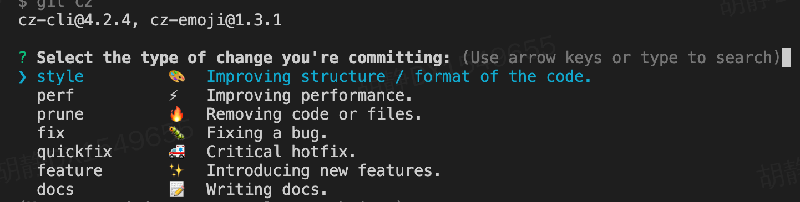

[博客地址](https://myblog-janehuhuhu.vercel.app/)
## jsome
**2021-09-06**
### 简介
美化在控制台打印的 `json` [jsome](https://github.com/Javascipt/Jsome)
<div style='margin-top: 30px'></div>

### 举例
```js
// 安装
yarn add jsome
yarn global add jsom

// 使用
var jsome = require('jsome')
jsome([{"id":1,"email":"Khalid@Morocco.ma","active":true},{"id":2,"email":"Someone@somewhere.com","active":false},{"id":3,"email":"chinese@bamboo.tree","active":true}])
```
效果展示：



<div style='margin-top: 100px'></div>


## parse-domain
解析一个主机名为域名、子域名、定级域名 [parse-domain](https://github.com/peerigon/parse-domain)

<div style='margin-top: 100px'></div>


## patch-package
`patch-package` 用打补丁的办法能快速修复第三方包的 *bug*, 而不用等待第三方包的修复。也可以适用于第三方包虽然修复了，但是又引入新 *bug* 的情况。[patch-package](https://www.npmjs.com/package/patch-package)

快速使用：在 *node_modules* 中修复 *bug* 后，执行 *npx patch-package xxx*, 内部通过比较修复后和源码，生成 *.patch* 文件，提交后其他开发同学即可使用修复后的第三方包 [案例](https://juejin.cn/post/6962554654643191815)

<div style='margin-top: 100px'></div>


## autoesm
`Node@13` 原生支持运行 *es6* 模块(import 语法)，但是需要在 *package.json* 的 *type* 中指定 *type: module*，或者导入 *.mjs* 后缀的文件 [type字段](https://blog.csdn.net/huzhenv5/article/details/105232187)

举例：都必须是 *mjs* 后缀才能运行，或者在最近的 *package.json* 中添加 *type*
```js
// a.mjs
export default function main() {
  console.log('aaaaa')
}

// b.mjs
import a from './a.mjs'
a()
```

在项目中安装 *autoesm* (全局不行), 运行命令 *node --experimental-loader autoesm b.js* 即可。[autoesm](https://github.com/dy/autoesm)

```js 
// a.js
export default function main() {
  console.log('aaaaa')
}

// b.js
import a from './a.js'
a()
```
<div style='margin-top: 100px'></div>


## ain
**2021-09-07**

一种终端类型的 *HTTP API* 客户端。简单来说，就是可以在终端定义访问的接口参数，并通过终端直接访问接口，有点类似于终端版的 *postman* 。可以支持 *curl, wget or httpie* 三种命令行 [Ain](https://github.com/jonaslu/ain)
<div style='margin-top: 100px'></div>


## cac
**2021-09-09**

`Command And Conquer` 是一个用于构建 `CLI` 应用程序的 `JavaScript` 库, 本质上和 `commander` 类似，一些 `api` 封装的更好些，其他暂时没有看出更大的优势 [cac](https://github.com/cacjs/cac)

```js
// commander
const program = require('commander')
program
  .command('help')
  .description('帮助')
  .action(() => {
    program.outputHelp()
  })

// cac
const cli = require('cac')()
cli.help()
```
<div style='margin-top: 100px'></div>


## package-size
**2021-09-14**

`package-size` 可以方便的计算某个包的大小，也可以计算某个文件的大小(一般指定了某个文件，其他同项目的大小都是之前指定的文件大小)[package-size](https://github.com/egoist/package-size)
<div style='margin-top: 100px'></div>


## cz-emoji
允许您使用 `commitizen` 在提交中轻松使用表情符号, 在展示效果前，先回顾下 `commitizen`, 它实际上为一种约束提交的 `message` 的工具，需要配合具体的规范使用（如 *cz-conventional-changelog* ）[cz-emoji](https://github.com/ngryman/cz-emoji)
```js
// 安装规范和cli
yarn add commitizen cz-conventional-changelog

// 配置
"script": {
    ...,
    "commit": "git cz",
},
 "config": {
    "commitizen": {
      "path": "node_modules/cz-conventional-changelog"
    }
  }
```

效果如下：

<div style='margin-top: 30px'></div>

使用 `cz-emoji` 效果如下，多加了几个表情

<div style='margin-top: 100px'></div>


